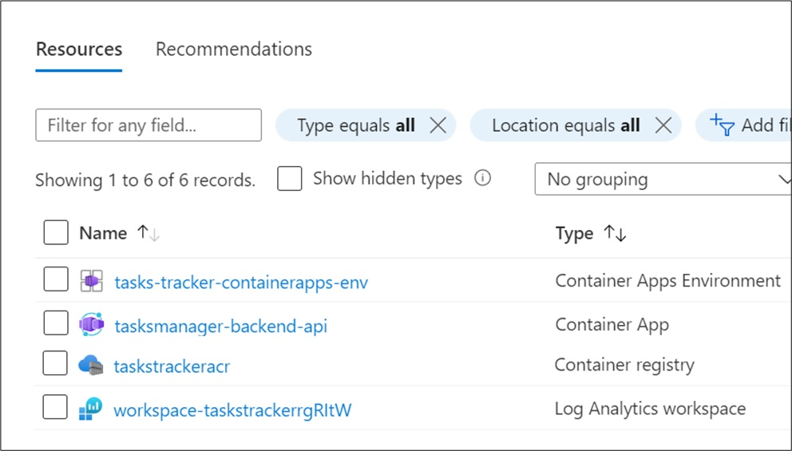

# Module 1 - Deploy Backend API to ACA

!!! info "Module Duration"
    60 minutes

!!! note "Prerequisities"

    Please ensure that all [prerequisites](../00-workshop-intro/4-prerequisites.md){target=_blank} have been taken care of prior to continuing.

## Objective

In this module, we will accomplish three objectives:

1. Create the first microservice, `{{ apps.backend}}`, which serves as the API for our tasks.
1. Create the initial Azure infrastructure that we will need throughout this workshop.
1. Deploy the `{{ apps.backend }}` container app to Azure.

## Module Sections

### 1. Create the backend API project (Web API)

- If a terminal is not yet open, from VS Code's *Terminal* tab, select *New Terminal* to open a (PowerShell or Bash ) terminal in the project folder *TasksTracker.ContainerApps* (also referred to as *root*).

- We need to define the .NET version we will use throughout this workshop. In the terminal execute `dotnet --info` or, more specifically, `dotnet --list-sdks`. Take note of the installed .NET SDK versions and select the one with which you wish to proceed.

- In the root folder create a new file and set the .NET SDK version from the above command:

!!! note
    The version in the *global.json* files below may be outdated. Please ensure you use the correct versions based on what is on your machine.

    === ".NET 8"

        === "global.json"
        ```json hl_lines="3"
        --8<-- "docs/aca/01-deploy-api-to-aca/global-dotnet8.json"
        ```

    === ".NET 9"

        === "global.json"
        ```json hl_lines="3"
        --8<-- "docs/aca/01-deploy-api-to-aca/global-dotnet9.json"
        ```

- Now we can initialize the backend API project. This will create and ASP.NET Web API project scaffolded with a single controller.

    !!! note "Controller-Based vs. Minimal APIs"

        APIs can be created via the traditional, expanded controller-based structure with _Controllers_ and _Models_ folders, etc. or via the newer minimal APIs approach where controller actions are written inside _Program.cs_. The latter approach is preferential in a microservices project where the endpoints are overseeable and may easily be represented by a more compact view. As our workshop takes advantage of microservices, the use case for minimal APIs is given. However, in order to make the workshop a bit more demonstrable, we will - for now - stick with controller-based APIs.

    === ".NET 8 or above"

        ```shell
        dotnet new webapi --use-controllers -o TasksTracker.TasksManager.Backend.Api
        ```

- Delete the boilerplate `WeatherForecast.cs` and `Controllers\WeatherForecastController.cs` files from the new `TasksTracker.TasksManager.Backend.Api` project folder.

--8<-- "snippets/containerize-app.md"

- In the project root add a new folder named **Models** and create a new file with name below. These are the DTOs that will be used across the projects.

    === "TaskModel.cs"
    ```csharp
    --8<-- "docs/aca/01-deploy-api-to-aca/TaskModel.cs"
    ```

- In the project root create a new folder named **Services** as a sibling to the *Models* folder. Add the two files below to the *Services* folder. Add the Fake Tasks Manager service as we will work with data in memory in this module. Later on, we will implement a data store.

    === "ITasksManager.cs"
        ```csharp
        --8<-- "docs/aca/01-deploy-api-to-aca/ITasksManager.cs"
        ```

    === "FakeTasksManager.cs"
        ```csharp
        --8<-- "docs/aca/01-deploy-api-to-aca/FakeTasksManager.cs"
        ```

- The code above generates ten tasks and stores them in a list in memory. It also has some operations to add/remove/update those tasks.

- Now we need to register `FakeTasksManager` on project startup. Open file `#!csharp Program.cs` and register the newly created service by adding the highlighted lines from below snippet. Don't forget to include the required `using` statement for the task interface and class.

    === ".NET 8"

        === "Program.cs"
        ```csharp hl_lines="1 7"
        --8<-- "docs/aca/01-deploy-api-to-aca/Program-dotnet8.cs"
        ```

    === ".NET 9"

        === "Program.cs"
        ```csharp hl_lines="1 7"
        --8<-- "docs/aca/01-deploy-api-to-aca/Program-dotnet9.cs"
        ```

- Inside the **Controllers** folder create a new controller with the below filename. We need to create API endpoints to manage tasks.

    === "TasksController.cs"
    ```csharp
    --8<-- "docs/aca/01-deploy-api-to-aca/TasksController.cs"
    ```

- From VS Code Terminal tab, navigate to the parent directory which hosts the `.csproj` project folder and build the project.

    === "PowerShell"
        ```shell
        cd ~\TasksTracker.ContainerApps\TasksTracker.TasksManager.Backend.Api
        dotnet build
        ```
    === "Bash"
        ```shell
        cd $PROJECT_ROOT/TasksTracker.TasksManager.Backend.Api
        dotnet build
        ```

!!! note
    Throughout the documentation, we will use the the tilde character [~] to represent the base / parent folder where you chose to install the workshop assets.

Make sure that the build is successful and that there are no build errors. Usually you should see a "Build succeeded" message in the terminal upon a successful build.

--8<-- "snippets/persist-state.md:module1"

### 2. Create Azure Infrastructure

#### 2.1 Define the Basics

We will be using Azure CLI to deploy the Web API Backend to ACA as shown in the following steps:

- First, we need to ensure that our CLI is updated. Then we log in to Azure.

    === "PowerShell"
        ```shell
        # Upgrade the Azure CLI
        az upgrade

        # Install/upgrade the Azure Container Apps & Application Insights extensions
        az extension add --upgrade --name containerapp
        az extension add --upgrade --name application-insights

        # Log in to Azure
        az login
        ```
    === "Bash"
        ```shell
        # Upgrade the Azure CLI
        az upgrade

        # Install/upgrade the Azure Container Apps & Application Insights extensions
        az extension add --upgrade --name containerapp
        az extension add --upgrade --name application-insights

        # Log in to Azure
        az login
        ```

- You may be able to use the queried Azure subscription ID or you may need to set it manually depending on your setup.

    === "PowerShell"
        ```shell
        # Retrieve the currently active Azure subscription ID
        $AZURE_SUBSCRIPTION_ID = az account show --query id --output tsv

        # Set a specific Azure Subscription ID (if you have multiple subscriptions)
        # $AZURE_SUBSCRIPTION_ID = "<Your Azure Subscription ID>" # Your Azure Subscription id which you can find on the Azure portal
        # az account set --subscription $AZURE_SUBSCRIPTION_ID

        echo $AZURE_SUBSCRIPTION_ID
        ```
    === "Bash"
        ```shell
        # Retrieve the currently active Azure subscription ID
        export AZURE_SUBSCRIPTION_ID=$(az account show --query id --output tsv)

        # Set a specific Azure Subscription ID (if you have multiple subscriptions)
        # export AZURE_SUBSCRIPTION_ID="<Your Azure Subscription ID>" # Your Azure Subscription id which you can find on the Azure portal
        # az account set --subscription $AZURE_SUBSCRIPTION_ID

        echo $AZURE_SUBSCRIPTION_ID
        ```

- Execute the variables below in the console to use them across the different modules in the workshop. Some of these variables must be globally unique, which we attempt by using `$RANDOM_STRING`:

    === "PowerShell"
        ```shell
        # Create a random, 6-digit, Azure safe string
        $RANDOM_STRING=-join ((97..122) + (48..57) | Get-Random -Count 6 | ForEach-Object { [char]$_})
        $RESOURCE_GROUP="rg-tasks-tracker-$RANDOM_STRING"
        $LOCATION="westus2"
        $ENVIRONMENT="cae-tasks-tracker"
        $WORKSPACE_NAME="log-tasks-tracker-$RANDOM_STRING"
        $APPINSIGHTS_NAME="appi-tasks-tracker-$RANDOM_STRING"
        $BACKEND_API_NAME="tasksmanager-backend-api"
        $AZURE_CONTAINER_REGISTRY_NAME="crtaskstracker$RANDOM_STRING"
        $VNET_NAME="vnet-tasks-tracker"
        $TARGET_PORT={{ docker.targetport }}
        ```
    === "Bash"
        ```shell
        # Create a random, 6-digit, Azure safe string
        export RANDOM_STRING=$(cat /dev/urandom | tr -dc 'a-z0-9' | fold -w 6 | head -n 1)
        export RESOURCE_GROUP="rg-tasks-tracker-$RANDOM_STRING"
        export LOCATION="westus2"
        export ENVIRONMENT="cae-tasks-tracker"
        export WORKSPACE_NAME="log-tasks-tracker-$RANDOM_STRING"
        export APPINSIGHTS_NAME="appi-tasks-tracker-$RANDOM_STRING"
        export BACKEND_API_NAME="tasksmanager-backend-api"
        export AZURE_CONTAINER_REGISTRY_NAME="crtaskstracker$RANDOM_STRING"
        export VNET_NAME="vnet-tasks-tracker"
        export TARGET_PORT={{ docker.targetport }}
        ```

???+ tip "Cloud Adoption Framework Abbreviations"
    Unless you have your own naming convention, we suggest to use [Cloud Adoption Framework (CAF) abbreviations](https://learn.microsoft.com/azure/cloud-adoption-framework/ready/azure-best-practices/resource-abbreviations){target=_blank} for resource prefixes.

- Create a resource group to organize the services related to the application, run the below command:

    === "PowerShell"
        ```shell
        az group create `
        --name $RESOURCE_GROUP `
        --location "$LOCATION"
        ```
    === "Bash"
        ```shell
        az group create \
        --name "$RESOURCE_GROUP" \
        --location "$LOCATION"
        ```

#### 2.2 Create Network Infrastructure

!!! note
    We are keeping this implementation simple. A production workload should have Network Security Groups and a firewall.

- We need to create a virtual network (VNet) to secure our container apps. Note that while the VNet size with `/16` CIDR is arbitrary, the container app subnet must have at least a `/27` CIDR.

    === "PowerShell"
        ```shell
        az network vnet create `
        --name $VNET_NAME `
        --resource-group $RESOURCE_GROUP `
        --address-prefix 10.0.0.0/16 `
        --subnet-name ContainerAppSubnet `
        --subnet-prefix 10.0.0.0/27
        ```
    === "Bash"
        ```shell
        az network vnet create \
        --name "$VNET_NAME" \
        --resource-group "$RESOURCE_GROUP" \
        --address-prefix 10.0.0.0/16 \
        --subnet-name ContainerAppSubnet \
        --subnet-prefix 10.0.0.0/27
        ```

- Azure Container Apps requires management of the subnet, so we must delegate exclusive control.

    === "PowerShell"
        ```shell
        az network vnet subnet update `
        --name ContainerAppSubnet `
        --resource-group $RESOURCE_GROUP `
        --vnet-name $VNET_NAME `
        --delegations Microsoft.App/environments
        ```
    === "Bash"
        ```shell
        az network vnet subnet update \
        --name ContainerAppSubnet \
        --resource-group "$RESOURCE_GROUP" \
        --vnet-name "$VNET_NAME" \
        --delegations Microsoft.App/environments
        ```

- Retrieve the Azure Container App subnet resource ID as it will be referenced when the Azure Container App Environment is created later.

    === "PowerShell"
        ```shell
        $ACA_ENVIRONMENT_SUBNET_ID=$(az network vnet subnet show `
        --name ContainerAppSubnet `
        --resource-group $RESOURCE_GROUP `
        --vnet-name $VNET_NAME `
        --query id `
        --output tsv)
        ```
    === "Bash"
        ```shell
        export ACA_ENVIRONMENT_SUBNET_ID=$(az network vnet subnet show \
        --name ContainerAppSubnet \
        --resource-group "$RESOURCE_GROUP" \
        --vnet-name "$VNET_NAME" \
        --query id \
        --output tsv)
        ```

#### 2.3 Create Log Analytics workspace & Application Insights

- Create an Azure Log Analytics workspace which will provide a common place to store the system and application log data from all container apps running in the environment. Each environment should have its own Log Analytics workspace.

    === "PowerShell"
        ```shell
        # Create the Log Analytics workspace
        az monitor log-analytics workspace create `
        --resource-group $RESOURCE_GROUP `
        --workspace-name $WORKSPACE_NAME

        # Retrieve the Log Analytics workspace ID
        $WORKSPACE_ID=az monitor log-analytics workspace show `
        --resource-group $RESOURCE_GROUP `
        --workspace-name $WORKSPACE_NAME `
        --query customerId `
        --output tsv

        # Retrieve the Log Analytics workspace secret
        $WORKSPACE_SECRET=az monitor log-analytics workspace get-shared-keys `
        --resource-group $RESOURCE_GROUP `
        --workspace-name $WORKSPACE_NAME `
        --query primarySharedKey `
        --output tsv
        ```
    === "Bash"
        ```shell
        # Create the Log Analytics workspace
        az monitor log-analytics workspace create \
        --resource-group "$RESOURCE_GROUP" \
        --workspace-name "$WORKSPACE_NAME"

        # Retrieve the Log Analytics workspace ID
        export WORKSPACE_ID=$(az monitor log-analytics workspace show \
        --resource-group "$RESOURCE_GROUP" \
        --workspace-name "$WORKSPACE_NAME" \
        --query customerId \
        --output tsv)

        # Retrieve the Log Analytics workspace secret
        export WORKSPACE_SECRET=$(az monitor log-analytics workspace get-shared-keys \
        --resource-group "$RESOURCE_GROUP" \
        --workspace-name "$WORKSPACE_NAME" \
        --query primarySharedKey \
        --output tsv)
        ```

- Create an [Application Insights](https://learn.microsoft.com/azure/azure-monitor/app/app-insights-overview?tabs=net){target=_blank} instance which will be used mainly for [distributed tracing](https://learn.microsoft.com/azure/azure-monitor/app/distributed-tracing){target=_blank} between different container apps within the ACA environment to provide searching for and visualizing an end-to-end flow of a given execution or transaction. To create it, run the command below:

    === "PowerShell"
        ```shell
        # Create Application Insights instance
        az monitor app-insights component create `
        --resource-group $RESOURCE_GROUP `
        --location $LOCATION `
        --app $APPINSIGHTS_NAME `
        --workspace $WORKSPACE_NAME

        # Get Application Insights Instrumentation Key
        $APPINSIGHTS_INSTRUMENTATIONKEY=($(az monitor app-insights component show `
        --resource-group $RESOURCE_GROUP `
        --app $APPINSIGHTS_NAME `
        --output json) | ConvertFrom-Json).instrumentationKey

        echo $APPINSIGHTS_INSTRUMENTATIONKEY
        ```
    === "Bash"
        ```shell
        # Create Application Insights instance
        az monitor app-insights component create \
        --resource-group "$RESOURCE_GROUP" \
        --location "$LOCATION" \
        --app "$APPINSIGHTS_NAME" \
        --workspace "$WORKSPACE_NAME"

        # Get Application Insights Instrumentation Key
        export APPINSIGHTS_INSTRUMENTATIONKEY=$(az monitor app-insights component show \
        --resource-group "$RESOURCE_GROUP" \
        --app "$APPINSIGHTS_NAME" \
        --output tsv --query instrumentationKey)

        echo $APPINSIGHTS_INSTRUMENTATIONKEY
        ```

#### 2.4 Azure Container Infrastructure

- Create an Azure Container Registry (ACR) instance in the resource group to store images of all Microservices we are going to build during this workshop. Make sure that you set the `admin-enabled` flag to true in order to seamlessly authenticate the Azure container app when trying to create the container app using the image stored in ACR.

    === "PowerShell"
        ```shell
        az acr create `
        --name $AZURE_CONTAINER_REGISTRY_NAME `
        --resource-group $RESOURCE_GROUP `
        --sku Basic `
        --admin-enabled true
        ```
    === "Bash"
        ```shell
        az acr create \
        --name "$AZURE_CONTAINER_REGISTRY_NAME" \
        --resource-group "$RESOURCE_GROUP" \
        --sku Basic \
        --admin-enabled true
        ```

!!! note
    Notice that we create the registry with admin rights `--admin-enabled` flag set to `true` which is not suited for real production, but good for our workshop.

- Now we will create an Azure Container Apps Environment. As a reminder of the different ACA components, [see this link in the workshop introduction](../../aca/00-workshop-intro/1-aca-core-components.md). The ACA environment acts as a secure boundary around a group of container apps that we are going to provision during this workshop.

    === "PowerShell"
        ```shell
        # Create the ACA environment
        az containerapp env create `
        --name $ENVIRONMENT `
        --resource-group $RESOURCE_GROUP `
        --location $LOCATION `
        --logs-workspace-id $WORKSPACE_ID `
        --logs-workspace-key $WORKSPACE_SECRET `
        --dapr-instrumentation-key $APPINSIGHTS_INSTRUMENTATIONKEY `
        --enable-workload-profiles `
        --infrastructure-subnet-resource-id $ACA_ENVIRONMENT_SUBNET_ID
        ```
    === "Bash"
        ```shell
        # Create the ACA environment
        az containerapp env create \
        --name "$ENVIRONMENT" \
        --resource-group "$RESOURCE_GROUP" \
        --location "$LOCATION" \
        --logs-workspace-id "$WORKSPACE_ID" \
        --logs-workspace-key "$WORKSPACE_SECRET" \
        --dapr-instrumentation-key "$APPINSIGHTS_INSTRUMENTATIONKEY" \
        --enable-workload-profiles \
        --infrastructure-subnet-resource-id "$ACA_ENVIRONMENT_SUBNET_ID"
        ```

!!! note
    We are not creating an `internal-only` Azure Container App Environment. This means that the static IP will be a public IP, and container apps, by default, will be publicly available on the internet.
    While this is not advised in a production workload, it is suitable for the workshop to keep the architecture confined to Azure Container Apps.

??? tip "Want to learn what the above command does?"
    - It creates an ACA environment and associates it with the Log Analytics workspace created in the previous step.
    - We are setting the `--dapr-instrumentation-key` value to the instrumentation key of the Application Insights instance. This will come handy when we introduce Dapr in later modules and show how the distributed tracing between microservices/container apps are captured and visualized in Application Insights.
    > ***NOTE:***
    You can set the `--dapr-instrumentation-key` after you create the ACA environment but this is not possible via the AZ CLI right now. There is an [open issue](https://github.com/microsoft/azure-container-apps/issues/293){target=_blank} which is being tracked by the product group.

### 3. Deploy Web API Backend Project to ACA

- Build the Web API project on ACR and push the docker image to ACR. Use the below command to initiate the image build and push process using ACR. The `.` at the end of the command represents the docker build context, in our case, we need to be on the parent directory which hosts the `.csproj`.

    === "PowerShell"
        ```shell
        az acr build `
        --registry $AZURE_CONTAINER_REGISTRY_NAME `
        --image "tasksmanager/$BACKEND_API_NAME" `
        --file 'TasksTracker.TasksManager.Backend.Api/Dockerfile' .
        ```
    === "Bash"
        ```shell
        az acr build \
        --registry "$AZURE_CONTAINER_REGISTRY_NAME" \
        --image "tasksmanager/$BACKEND_API_NAME" \
        --file "TasksTracker.TasksManager.Backend.Api/Dockerfile" .
        ```

    Once this step is completed, you can verify the results by going to the [Azure portal](https://portal.azure.com){target=_blank} and checking that a new repository named `tasksmanager/tasksmanager-backend-api` has been created, and that there is a new Docker image with a `latest` tag.

- The last step here is to create and deploy the Web API to ACA following the below command:

    === "PowerShell"
        ```shell
        $fqdn=(az containerapp create `
        --name $BACKEND_API_NAME `
        --resource-group $RESOURCE_GROUP `
        --environment $ENVIRONMENT `
        --image "$AZURE_CONTAINER_REGISTRY_NAME.azurecr.io/tasksmanager/$BACKEND_API_NAME" `
        --registry-server "$AZURE_CONTAINER_REGISTRY_NAME.azurecr.io" `
        --target-port $TARGET_PORT `
        --ingress 'external' `
        --min-replicas 1 `
        --max-replicas 1 `
        --cpu 0.25 `
        --memory 0.5Gi `
        --query properties.configuration.ingress.fqdn `
        --output tsv)

        $BACKEND_API_EXTERNAL_BASE_URL="https://$fqdn"

        echo "See a listing of tasks created by the author at this URL:"
        echo "https://$fqdn/api/tasks/?createdby=tjoudeh@bitoftech.net"
        ```
    === "Bash"
        ```shell
        fqdn=$(az containerapp create \
        --name "$BACKEND_API_NAME" \
        --resource-group "$RESOURCE_GROUP" \
        --environment "$ENVIRONMENT" \
        --image "$AZURE_CONTAINER_REGISTRY_NAME.azurecr.io/tasksmanager/$BACKEND_API_NAME" \
        --registry-server "$AZURE_CONTAINER_REGISTRY_NAME.azurecr.io" \
        --target-port "$TARGET_PORT" \
        --ingress external \
        --min-replicas 1 \
        --max-replicas 1 \
        --cpu 0.25 \
        --memory 0.5Gi \
        --query properties.configuration.ingress.fqdn \
        --output tsv)

        export BACKEND_API_EXTERNAL_BASE_URL="https://$fqdn"

        echo "See a listing of tasks created by the author at this URL:"
        echo "https://$fqdn/api/tasks/?createdby=tjoudeh@bitoftech.net"
        ```

??? tip "Want to learn what the above command does?"
    - Ingress param is set to `external` which means that this container app (Web API) project will be accessible from the public internet. When Ingress is set to `Internal` or `External` it will be assigned a fully qualified domain name (FQDN). Important notes about IP addresses and domain names can be found [here](https://learn.microsoft.com/azure/container-apps/ingress?tabs=bash#ip-addresses-and-domain-names){target=_blank}.
    - The target port param is set to 80, this is the port our Web API container listens to for incoming requests.
    - We didn't specify the ACR registry username and password, `az containerapp create` command was able to look up ACR username and password and add them as a secret under the created Azure container app for future container updates.
    - The minimum and the maximum number of replicas are set. More about this when we cover Autoscaling in later modules. For the time being, only a single instance of this container app will be provisioned as Auto scale is not configured.
    - We set the size of the Container App. The total amount of CPUs and memory requested for the container app must add up to certain combinations, for full details check the link [here](https://docs.microsoft.com/azure/container-apps/containers#configuration){target=_blank}.
    - The `query` property will filter the response coming from the command and just return the FQDN. Take note of this FQDN as you will need it for the next step.

    For full details on all available parameters for this command, please visit this [page](https://docs.microsoft.com/cli/azure/containerapp?view=azure-cli-latest#az-containerapp-create){target=_blank}.

- You can now verify the deployment of the first ACA by navigating to the link at the end of the above script or to the [Azure portal](https://portal.azure.com){target=_blank} and selecting the resource group named `tasks-tracker-rg` that you created earlier. You should see the 5 resourses created below.


!!! success
    To test the backend api service, either click on the URL output by the last command or copy the FQDN (Application URL) of the Azure container app named `tasksmanager-backend-api`, then issue a `GET` request similar to this one: `https://tasksmanager-backend-api.<your-aca-env-unique-id>.eastus.azurecontainerapps.io/api/tasks/?createdby=tjoudeh@bitoftech.net` and you should receive an array of the 10 tasks similar to the below image.

    Note that the specific query string matters as you may otherwise get an empty result back.

    !!! tip
        You can find your Azure container app application url on the [Azure portal](https://portal.azure.com){target=_blank} overview tab.

        

--8<-- "snippets/update-variables.md"

***

## Review

In this module, we have accomplished three objectives:

1. Created the first microservice, `{{ apps.backend }}`, which serves as the API for our tasks.
1. Created the initial Azure infrastructure that we will need throughout this workshop.
1. Deployed the `{{ apps.backend }}` microservice to Azure.

In the next module, we will add a new frontend web app as a microservice to communicate with the backend API.
