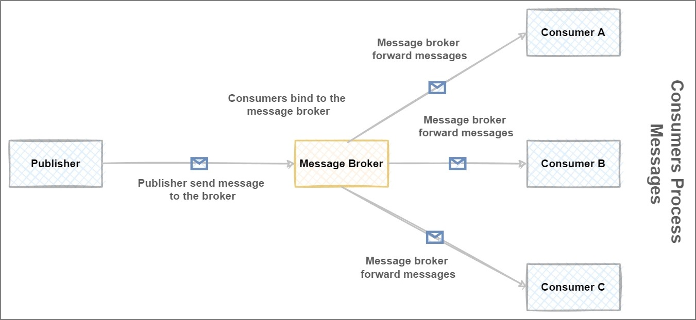

# Module 5 - ACA Async Communication with Dapr Pub/Sub API

In this module, we will introduce a new background service which is named `ACA-Processer Backend` according to our [architecture diagram](../../assets/images/00-workshop-intro/ACA-Architecture-workshop.jpg). This new service will be responsible for sending notification emails (simulated) to task owners to notify them that a new task has been assigned to them. We can do this in the Backend API and send the email right after saving the task, but we want to offload this process to another service and keep the Backend API service responsible for managing tasks data only.

To do this the right way, we need to decouple the 2 services from each other, so this means we are going to rely on the Publisher-Subscriber pattern (Pub/Sub Pattern).
The main advantage of this pattern is that it offers loose coupling between services, the sender/publisher of the message doesn't know anything about the receiver/consumers, even you can have multiple consumers consuming a copy of the message in a totally different way, think of adding another consumer which is responsible to send push notification for the task owner (If we have a mobile app channel).

The publisher/subscriber pattern relies on a message broker which is responsible for receiving the message from the publisher, storing the message to ensure durability, and delivering this message to the interested consumer(s) to process it. There is no need for the consumers to be available when the message is stored in the message broker, consumers can process the messages at a later time when they are available. The below diagram gives a high-level overview of how the pub/sub pattern works



If you implemented the Pub/Sub pattern before, you already noticed that there is a lot of plumbing needed on the publisher and subscriber components in order to publish and consume messages, as well each message broker has it is own SDK and implementation, so you need to write your code in an abstracted way to hide the specific implementation details for each message broker SDK and make it easier for publisher and consumers to re-use this. What Dapr offers here is a building block that significantly simplifies implementing pub/sub functionality.

In very simple words, the Dapr pub/sub building block provides a platform-agnostic API framework to send and receive messages. Your producer/publisher services publish messages to a named topic. Your consumer services subscribe to a topic to consume messages.

To try this out we can directly invoke the Pub/Sub API and publish a message to Redis locally, if you remember from this [module](../../aca/03-aca-dapr-integration/index.md) once we initialized Dapr in a local development environment, it installed Redis container instance locally, so we can use Redis locally to publish and subscribe to message. If you navigate to the path `<UserProfile>\.dapr\components` you find a file named `pubsub.yaml`. Inside this file, you will see the properties needed to access the local Redis instance. The publisher/subscriber brokers template component file structure can be found on [this link](https://docs.dapr.io/operations/components/setup-pubsub/).

We want to have more control and provide our own component file, so let's create a pub/sub component file in our `components` folder, so go ahead and add a new file named `dapr-pubsub-redis.yaml` under the folder `components`. The content of the file will be as the below:

```powershell
apiVersion: dapr.io/v1alpha1
kind: Component
metadata:
  name: taskspubsub
spec:
  type: pubsub.redis
  version: v1
  metadata:
  - name: redisHost
    value: localhost:6379
  - name: redisPassword
    value: ""
```

To try out the Pub/Sub API, run the Backend API from VS Code by running the below command or using the Run and Debug tasks we have created in the appendix [post](../../aca/20-appendix/01-run-debug-dapr-app-vscode.md). Don't forget to include the property `–components-path` if you are using dapr run from PowerShell:

```powershell
dapr run --app-id tasksmanager-backend-api --app-port 7088 --dapr-http-port 3500 --app-ssl --components-path "../components" dotnet run
```

Now let's try to publish a message by sending a POST request to `http://localhost:3500/v1.0/publish/taskspubsub/tasksavedtopic` with the below request body, don't forget to set the `Content-Type` header to `application/json`

```json
{
    "taskId": "fbc55b2c-d9fa-405e-aec8-22e53f4306dd",
    "taskName": "Testing Pub Sub Publisher",
    "taskCreatedBy": "user@mail.net",
    "taskCreatedOn": "2023-02-12T00:24:37.7361348Z",
    "taskDueDate": "2023-02-20T00:00:00",
    "taskAssignedTo": "user2@mail.com"
}
```
Looking at the endpoint, we can break it into the following:

* The value `3500`: is the Dapr app listing port, it is the port number upon which the Dapr sidecar is listening.
* The value `taskspubsub`: is the name of the selected Dapr pub/sub-component.
* The value `tasksavedtopic`: is the name of the topic to which the message is published.

If all is configured correctly, you should receive HTTP response 204 from this endpoint which indicates that the message is published successfully by the service broker (Redis) into the topic named `tasksavedtopic`. You can check that topic is created successfully by using the [Redis Xplorer extension](https://marketplace.visualstudio.com/items?itemName=davidsekar.redis-xplorer) in VS Code.

{: .note }
Some Service Brokers allows the creation of topics automatically when sending a message to a topic which is not been created before, that's the clarification of why the topic `tasksavedtopic` is created automatically.

Right now those published messages are stored in the message broker topic doing nothing as we don't have any subscribers bound to the service broker on the topic `tasksavedtopic` which is interested to consume and process those messages. So let`s add a consumer to consume the message.

### Setting up the Backend Background Processor Project

##### 1. Create a Web API Project

Now we will add a new ASP.NET Core Web API project named `TasksTracker.Processor.Backend.Svc`. Open a command-line terminal and navigate to root folder of your project. Create a new folder as shown below:
```shell
mkdir TasksTracker.Processor.Backend.Svc
cd TasksTracker.Processor.Backend.Svc
```
From VS Code Terminal tab, open developer command prompt or PowerShell terminal in the project folder `TasksTracker.Processor.Backend.Svc` and initialize the project by typing: `dotnet new webapi  -o TasksTracker.Processor.Backend.Svc` This will create and ASP.NET Web API project scaffolded with 1 single controller.

We need to containerize this application so we can push it to Azure Container Registry as a docker image then deploy it to ACA, to do so Open the VS Code Command Palette (<kbd>Ctrl</kbd> + <kbd>Shift</kbd> + <kbd>p</kbd>) and select `Docker: Add Docker Files to Workspace...`
- Use `.NET: ASP.NET Core` when prompted for application platform.
- Choose `Linux` when prompted to choose the operating system.
- You will be asked if you want to add Docker Compose files. Select `No`.
- Take a not of the provided **application port** as we will be using later on.
- `Dockerfile` and `.dockerignore` files are added to the workspace.

##### 2. Add Models (DTO)

Now we will add the DTO which will be used to deserialize the published message, so add a new file named `TaskModel.cs` under a new folder named `Models` and paste the code below:

```csharp
namespace TasksTracker.Processor.Backend.Svc.Models
{
    public class TaskModel
    {
        public Guid TaskId { get; set; }
        public string TaskName { get; set; } = string.Empty;
        public string TaskCreatedBy { get; set; } = string.Empty;
        public DateTime TaskCreatedOn { get; set; }
        public DateTime TaskDueDate { get; set; }
        public string TaskAssignedTo { get; set; } = string.Empty;
        public bool IsCompleted { get; set; }
        public bool IsOverDue { get; set; }
    }
}
```

##### 3.Install Dapr SDK Client NuGet package
Now we will install Dark SDK for .NET Core in the Backend Background Service to be able to subscribe to the service broker topic in a programmatic way, to do so, open the .csproj file of the project `TasksTracker.Processor.Backend.Svc.csproj` and add the below NuGet package:

```json
<ItemGroup> 
   <PackageReference Include="Dapr.AspNetCore" Version="1.9.0" /> 
</ItemGroup>
```

##### 4. Create an API endpoint for the consumer to subscribe to the topic
Now we will add an endpoint that will be responsible to subscribe to the topic in the message broker we are interested in, this endpoint will start receiving the message published from the Backend API producer, to do so, add a new controller named `TasksNotifierController.cs` under `Controllers` folder and use the code below:

```csharp
using Dapr.Client;
using Microsoft.AspNetCore.Mvc;
using TasksTracker.Processor.Backend.Svc.Models;

namespace TasksTracker.Processor.Backend.Svc.Controllers
{
    [Route("api/tasksnotifier")]
    [ApiController]
    public class TasksNotifierController : ControllerBase
    {
        private readonly IConfiguration _config;
        private readonly ILogger _logger;
        public TasksNotifierController(IConfiguration config, ILogger<TasksNotifierController> logger)
        {
            _config = config;
            _logger = logger;
        }

        public IActionResult Get()
        {
            return Ok();
        }

        [Dapr.Topic("taskspubsub", "tasksavedtopic")]
        [HttpPost("tasksaved")]
        public async Task<IActionResult> TaskSaved([FromBody] TaskModel taskModel)
        {
            _logger.LogInformation("Started processing message with Task Name '{0}'", taskModel.TaskName);

             //Do the actual sending of emails here, return 200 ok to consume the message
             return Ok();
            //Incase we need to return message back to the topic, return http 400 request
            //return BadRequest();
        }
    }
}
```

What we have implemented here is the following:

* We have added an action method named `TaskSaved` which can be accessed on the route `api/tasksnotifier/tasksaved`
* We have attributed this action method with the attribute `Dapr.Topic` which accepts the Dapr pub/sub component to target as the first argument, and the second argument is the topic to subscribe to, in our case `tasksavedtopic`.
* The action method expects to receive a `TaskModel` object.
* Now once the message is received by this endpoint, we can start out business logic to trigger sending an email (more about this next) and then return `200 OK` responses to indicate that the consumer processed the message successfully and the broker can delete this message.
* If anything went wrong during sending the email (i.e. Email service not responding) and we want to retry processing this message at a later time, we return `400 Bad Request`, this will inform the message broker that the message needs to be retired based on the configuration in the message broker.
* If we need to drop the message as we are aware it will not be processed even after retries (i.e Email to is not formatted correctly) we return a `404 Not Found` response, this will tell the message broker to drop the message and move it to dead-letter or poison queue.

Now you will ask yourselves how the consumer was able to identify what are the subscriptions available and on which route they can be found, the answer for this that at startup on the consumer service, the Dapr runtime will call the application on a well-known endpoint to identify and create the required subscriptions. The well-known endpoint can be reached on this endpoint: `http://localhost:<appPort>/dapr/subscribe`
When you invoke this endpoint, the response will contain an array of all available topics for which the applications will subscribe. Each includes a route to call when the topic receives a message, this was generated as we used the attribute `Dapr.Topic` on the action method `api/tasksnotifier/tasksaved`. That means when a message is published on the Pubsubname `taskspubsub` on the topic `tasksavedtopic`, it will be routed to the action method `/api/tasksnotifier/tasksaved` and will be consumed in this action method.

In our case, a sample response will be as below:
```json
[
  {
    "pubsubname": "taskspubsub",
    "topic": "tasksavedtopic",
    "route": "/api/tasksnotifier/tasksaved"
  }
]
```
In this [link](https://learn.microsoft.com/en-us/dotnet/architecture/dapr-for-net-developers/publish-subscribe#how-it-works), you find a detailed diagram of how the consumers will discover and subscribe to those endpoints.

##### 5. Register Dapr and Subscribe handler at the consumer startup
Open file `Programs.cs` in the project `TasksTracker.Processor.Backend.Svc` and paste the code below

```csharp
namespace TasksTracker.Processor.Backend.Svc
{
    public class Program
    {
        public static void Main(string[] args)
        {
            var builder = WebApplication.CreateBuilder(args);
            // Add services to the container.
            builder.Services.AddControllers().AddDapr();
            var app = builder.Build();
            app.UseHttpsRedirection();
            app.UseAuthorization();
            app.UseCloudEvents();
            app.MapControllers();
            app.MapSubscribeHandler();
            app.Run();
        }
    }
}
```
What we've done is the following:
* In line `builder.Services.AddControllers().AddDapr();`, the extension method `AddDapr` registers the necessary services to integrate Dapr into the MVC pipeline. It also registers a `DaprClient` instance into the dependency injection container, which then can be injected anywhere into your service. We will see how we are injecting DaprClient in the controller constructor later on.
* In line `app.UseCloudEvents();`, the extension method `UseCloudEvents` adds CloudEvents middleware into the ASP.NET Core middleware pipeline. This middleware will unwrap requests that use the CloudEvents structured format, so the receiving method can read the event payload directly. You can read more about [CloudEvents](https://cloudevents.io/) here. (Specs to describing event data in a common and standard way)
* In line `app.MapSubscribeHandler();`, in order to make the endpoint `http://localhost:<appPort>/dapr/subscribe` available for the consumer so it responds and returns available subscriptions we need to configure the consumer to do this by calling `MapSubscribeHandler`. When this endpoint is called, it will automatically find all WebAPI action methods decorated with the `Dapr.Topic` attribute and instruct Dapr to create subscriptions for them.

With all those bits in place, we are ready to run the publisher service `Backend API` and the consumer service `Backend Background Service` and test pub/sub pattern end to end, to do so, run the below commands in PowerShell console, ensure you are on the right root folder.

```powershell
~\TasksTracker.ContainerApps\TasksTracker.TasksManager.Backend.Api> dapr run --app-id tasksmanager-backend-api --app-port 7088 --dapr-http-port 3500 --app-ssl --components-path "../components" dotnet run 

~\TasksTracker.ContainerApps\TasksTracker.Processor.Backend.Svc> dapr run --app-id tasksmanager-backend-processor --app-port 7263 --dapr-http-port 3502 --app-ssl --components-path "../components" dotnet run
```

Notice that we gave the new Backend background service a Dapr App Id with the name `tasksmanager-backend-processor` and a Dapr HTTP port with the value `3502`.

Let's try to publish a message now from the Backend API similar to what we have done earlier by sending this POST request:

```json
POST /v1.0/publish/taskspubsub/tasksavedtopic HTTP/1.1
Host: localhost:3500
Content-Type: application/json
{
    "taskId": "fbc55b2c-d9fa-405e-aec8-22e53f4306dd",
    "taskName": "Testing Pub Sub Publisher",
    "taskCreatedBy": "user@mail.net",
    "taskCreatedOn": "2023-02-12T00:24:37.7361348Z",
    "taskDueDate": "2023-02-20T00:00:00",
    "taskAssignedTo": "user2@mail.com"
}
```

Keep eye on the terminal logs of the Backend background processor, you will see that the message is received and consumed by the action method `api/tasksnotifier/tasksaved` and an information message is logged in the terminal to indicate the processing of the message.

**Hint:** You can use VS Code [Dapr Extension](https://marketplace.visualstudio.com/items?itemName=ms-azuretools.vscode-dapr) to publish the message directly, it will be similar to the below image:


##### 6. Optional: Update VS Code tasks and launch configuration files

If you have followed the steps in the [appendix](../../aca/20-appendix/01-run-debug-dapr-app-vscode.md) In order to be able to run the 3 services together and debug them in VS Code, we need to update the files `tasks.json` and `launch.json` to include the new service we have added, it will be similar to what we have done exactly in this post. You can use this file to update [tasks.json](https://github.com/Azure/aca-dotnet-workshop/blob/3dafcc7b291590177f7ce3a8a629079076149863/.vscode/tasks.json) and this file to update [launch.json](https://github.com/Azure/aca-dotnet-workshop/blob/3dafcc7b291590177f7ce3a8a629079076149863/.vscode/launch.json) files.

### Use the Dapr .NET Client SDK to publish messages

##### 1. Update Backend API to publish a message when a task is saved
Now we need to update our Backend API to publish a message to the message broker when a task is saved (a new task is added or an existing task assignee has changed when updating it).

To do this open file named `TasksStoreManager` under the project `TasksTracker.TasksManager.Backend.Api` and update the file as the following:

```csharp
//Add new private method
private async Task PublishTaskSavedEvent(TaskModel taskModel)
{
    _logger.LogInformation("Publish Task Saved event for task with Id: '{0}' and Name: '{1}' for Assigne: '{2}'",
    taskModel.TaskId, taskModel.TaskName, taskModel.TaskAssignedTo);
    await _daprClient.PublishEventAsync("dapr-pubsub-servicebus", "tasksavedtopic", taskModel);
}

//Update the below method:
    public async Task<Guid> CreateNewTask(string taskName, string createdBy, string assignedTo, DateTime dueDate)
    {
        var taskModel = new TaskModel()
        {
            TaskId = Guid.NewGuid(),
            TaskName = taskName,
            TaskCreatedBy = createdBy,
            TaskCreatedOn = DateTime.UtcNow,
            TaskDueDate = dueDate,
            TaskAssignedTo = assignedTo,
        };

        _logger.LogInformation("Save a new task with name: '{0}' to state store", taskModel.TaskName);
        await _daprClient.SaveStateAsync<TaskModel>(STORE_NAME, taskModel.TaskId.ToString(), taskModel);
        await PublishTaskSavedEvent(taskModel);
        return taskModel.TaskId;
    }
    
//Update the below method:
public async Task<bool> UpdateTask(Guid taskId, string taskName, string assignedTo, DateTime dueDate)
    {
        _logger.LogInformation("Update task with Id: '{0}'", taskId);
        var taskModel = await _daprClient.GetStateAsync<TaskModel>(STORE_NAME, taskId.ToString());
        var currentAssignee = taskModel.TaskAssignedTo;
        if (taskModel != null)
        {
            taskModel.TaskName = taskName;
            taskModel.TaskAssignedTo = assignedTo;
            taskModel.TaskDueDate = dueDate;
            await _daprClient.SaveStateAsync<TaskModel>(STORE_NAME, taskModel.TaskId.ToString(), taskModel);
            if (!taskModel.TaskAssignedTo.Equals(currentAssignee, StringComparison.OrdinalIgnoreCase))
            {
                await PublishTaskSavedEvent(taskModel);
            }
            return true;
        }
        return false;
    }
```
Notice the new method `PublishTaskSavedEvent` added to the class, all we have to do is to call the method `PublishTaskSavedEvent` and pass the Pub/Sub name, in our case I named it `dapr-pubsub-servicebus` as we are going to use Azure Service Bus as a message broker in the next step (Feel free to use any name you want), and the second parameter `tasksavedtopic` is the topic name the publisher going to send the task model to it, thats It for publishing, no extra changes needed to start publishing async messages from the Backend API.

##### 2. Update Backend Background Processor to consume messages and simulate sending emails

Open controller named `TasksNotifierController.cs` under Backend Processor Project and update the controller as the code below:

```csharp
namespace TasksTracker.Processor.Backend.Svc.Controllers
{
    [Route("api/tasksnotifier")]
    [ApiController]
    public class TasksNotifierController : ControllerBase
    {
        private readonly IConfiguration _config;
        private readonly ILogger _logger;
        private readonly DaprClient _daprClient;
        public TasksNotifierController(IConfiguration config, ILogger<TasksNotifierController> logger, DaprClient daprClient)
        {
            _config = config;
            _logger = logger;
            _daprClient = daprClient;
        }

        [Dapr.Topic("dapr-pubsub-servicebus", "tasksavedtopic")]
        [HttpPost("tasksaved")]
        public async Task<IActionResult> TaskSaved([FromBody] TaskModel taskModel)
        {
            _logger.LogInformation("Started processing message with Task Name '{0}'", taskModel.TaskName);
            var sendGridResponse = await SendEmail(taskModel);

            if (sendGridResponse.Item1)
            {
                return Ok($"SendGrid response status code: {sendGridResponse.Item1}");
            }
            return BadRequest($"Failed to send email, SendGrid response status code: {sendGridResponse.Item1}");
        }

        private async Task<Tuple<bool, string>> SendEmail(TaskModel taskModel)
        {
            var apiKey = _config.GetValue<string>("SendGrid:ApiKey");
            var sendEmailResponse = true;
            var sendEmailStatusCode = System.Net.HttpStatusCode.Accepted;
            var client = new SendGridClient(apiKey);
            var from = new EmailAddress("sender@mail.com", "Tasks Tracker Notification");
            var subject = $"Task '{taskModel.TaskName}' is assigned to you!";
            var to = new EmailAddress(taskModel.TaskAssignedTo, taskModel.TaskAssignedTo);
            var plainTextContent = $"Task '{taskModel.TaskName}' is assigned to you. Task should be completed by the end of: {taskModel.TaskDueDate.ToString("dd/MM/yyyy")}";
            var htmlContent = plainTextContent;
            var msg = MailHelper.CreateSingleEmail(from, to, subject, plainTextContent, htmlContent);
            var response = await client.SendEmailAsync(msg);
            sendEmailResponse = response.IsSuccessStatusCode;
            sendEmailStatusCode = response.StatusCode;
            return new Tuple<bool, string>(sendEmailResponse, sendEmailStatusCode.ToString());
        }
    }
}
```
What we've done In the code above is the following:
* We've updated the attribute `Dapr.Topic` to use the same Pub/Sub component name used in the publisher `dapr-pubsub-servicebus`. Then we add a new method that is responsible to consume the proceed message, taking the assignee email, and trying to send an email using SendGrid API.
* We are returning `200 Ok` if the SendGrid was able to send the email successfully, and we are returning `400 Bad Request` if the SendGrid failed to send the email, this will allow the consumer service to re-try processing the message again.
* Don't forget to add the NuGet package named `SendGrid` version `9.28.1` to the Backend processor project, as well we are reading the `SendGrid:ApiKey` from AppSettings, we will read this value from environment variables once we deploy this service to Azure Container Apps. So open the file named `appsettings.json` and add the below config:

```json
{
  "SendGrid": {
    "ApiKey": "",
    "IntegrationEnabled":false
  }
}
```
{: .note }
It is optional to use SendGrid APIs to send emails, you can use another service to complete the workshop or you can just simulate sending email by returning always `true` from the `SendEmail` method. [Next module](/aca/06-aca-dapr-bindingsapi/index.md/#1-create-dapr-sendgrid-output-binding-component-file) we will be using a new type of Dapr components to send emails using SendGrid.

### Use Azure Service Bus as a Service Broker for Dapr Pub/Sub API
Now we will switch our implementation to use Azure Service Bus as a message broker, Redis worked perfectly for local development and testing but we need to prepare ourselves for the cloud deployment, to do so we need to create Service Bus Namespace, then a Topic.

##### 1. Create Azure Service Bus Namespace and a Topic
You can do this from Azure Portal or use the below PowerShell command to create the services. I will assume you are using the same PowerShell session from the previous module so variables still hold the right values, you need to change the namespace variable as this one should be unique globally across all Azure subscriptions:

```powershell
$NamespaceName="taskstracker"
$TopicName="tasksavedtopic"
$TopicSubscription="tasks-processor-subscription"

##Create servicebus namespace
az servicebus namespace create --resource-group $RESOURCE_GROUP --name $NamespaceName --location $LOCATION

##Create a topic under namespace
az servicebus topic create --resource-group $RESOURCE_GROUP --namespace-name $NamespaceName --name $TopicName

##Create a topic subscription
az servicebus topic subscription create `
--resource-group $RESOURCE_GROUP `
--namespace-name $NamespaceName `
--topic-name $TopicName `
--name $TopicSubscription

##List connection string
az servicebus namespace authorization-rule keys list `
--resource-group $RESOURCE_GROUP `
--namespace-name $NamespaceName `
--name RootManageSharedAccessKey `
--query primaryConnectionString `
--output tsv
```

Note that the primary connection string is only needed for local dev testing, we will be using Managed Identities when publishing container apps to ACA.

##### 2. Create a local Dapr Component file for Pub/Sub API using Azure Service Bus

Go ahead and add a new file named `dapr-pubsub-svcbus.yaml` under the folder `components` and paste the code below:

```yaml
apiVersion: dapr.io/v1alpha1
kind: Component
metadata:
  name: dapr-pubsub-servicebus
spec:
  type: pubsub.azure.servicebus
  version: v1
  metadata:
  - name: connectionString # Used for local dev testing.
    value: "<connection string from step 1>"
  - name: consumerID
    value: "tasks-processor-subscription"
scopes:
- tasksmanager-backend-api
- tasksmanager-backend-processor
```

Note that we used the name `dapr-pubsub-servicebus` which should match the name of Pub/Sub component we've used earlier in the `TasksNotifierController.cs` controller on the action method with the attribute `Topic`. As well we have set the metadata (key/value) to allow us to connect to Azure Service Bus topic. The metadata `consumerID` value should match the topic subscription name `tasks-processor-subscription`. We have set the scopes section to include the `tasksmanager-backend-api` and `tasksmanager-backend-processor` app ids, as those will be the Dapr apps that needs access to Azure Service Bus for publishing and consuming the messages.

##### 3. Create a ACA Dapr Component file for Pub/Sub API using Azure Service Bus

Create a new yaml file named `containerapps-pubsub-svcbus.yaml` and add it under folder `aca-components`, use the file content below:

```yaml
# pubsub.yaml for Azure Service Bus component
componentType: pubsub.azure.servicebus
version: v1
metadata:
- name: namespaceName
  value: "taskstracker.servicebus.windows.net"
- name: consumerID
  value: "tasks-processor-subscription"  
# Application scopes  
scopes:
- tasksmanager-backend-api
- tasksmanager-backend-processor
```
Things to notice here:
- We didn't specify the component name `dapr-pubsub-servicebus` when we created this component file, we are going to specify it once we add this dapr component to Azure Container Apps Environment via CLI.
- We are not referencing any service bus connection strings as the authentication between Dapr and Azure Service Bus will be configured using Managed Identities. 
- The metadata `namespaceName` value is set to the address of the Service Bus namespace as a fully qualified domain name. The key is mandatory when using Managed Identities for authentication.
- We are setting the metadata `consumerID` value to match the topic subscription name `tasks-processor-subscription`. If you didn't set this metadata, dapr runtime will try to create a subscription using the dapr application ID.

### Deploy the Backend Background Processor and the Backend API Projects to Azure Container Apps

##### 1. Build the Backend Background Processor and the Backend API App images and push them to ACR

As we have done previously we need to build and deploy both app images to ACR so they are ready to be deployed to Azure Container Apps, to do so, continue using the same PowerShell console and paste the code below (Make sure you are on directory `TasksTracker.ContainerApps`):

```powershell
$BACKEND_SVC_NAME="tasksmanager-backend-processor"
az acr build --registry $ACR_NAME --image "tasksmanager/$BACKEND_API_NAME" --file 'TasksTracker.TasksManager.Backend.Api/Dockerfile' . 
az acr build --registry $ACR_NAME --image "tasksmanager/$BACKEND_SVC_NAME" --file 'TasksTracker.Processor.Backend.Svc/Dockerfile' .
```

##### 2. Create a new Azure Container App to host the new Backend Background Processor
Now we need to create a new Azure Container App, we need to have this new container app with those capabilities in place:

* Ingress for this container app should be disabled (No access via HTTP at all, this is a background processor responsible to process published messages).
* Dapr needs to be enabled.
* Setting the value of SendGrid API in the secrets store and referencing it in the environment variables, as well setting the flag `IntegrationEnabled` to `true` so it will send actual emails.
To achieve the above run the below PowerShell script and notice how we removed the Ingress property totally Ingress is disabled for this Container App:

```powershell
az containerapp create `
--name "$BACKEND_SVC_NAME"  `
--resource-group $RESOURCE_GROUP `
--environment $ENVIRONMENT `
--image "$ACR_NAME.azurecr.io/tasksmanager/$BACKEND_SVC_NAME" `
--registry-server "$ACR_NAME.azurecr.io" `
--min-replicas 1 `
--max-replicas 1 `
--cpu 0.25 --memory 0.5Gi `
--enable-dapr `
--dapr-app-id  $BACKEND_SVC_NAME `
--dapr-app-port 80 `
--secrets "sendgrid-apikey=Replace with your SendGrid API Key" `
--env-vars "SendGrid__ApiKey=secretref:sendgrid-apikey" "SendGrid__IntegrationEnabled=true"
```

##### 3. Deploy new revisions of the Backend API to Azure Container Apps
As we've done this multiple times we need to update the Azure Container App hosting the Backend API with a new revision so our code changes for publishing messages after a task is saved is available for users, to do so run the below PowerShell script:
```powershell
## Update Backend API App container app and create a new revision 
az containerapp update `
--name $BACKEND_API_NAME `
--resource-group $RESOURCE_GROUP `
--revision-suffix v20230220-1 
```

##### 4. Add Azure Service Bus Dapr Pub/Sub Component to Azure Container Apps Environment
Deploy the Dapr Pub/Sub Component to the Azure Container Apps Environment using the following command:
```powershell
az containerapp env dapr-component set `
--name $ENVIRONMENT --resource-group $RESOURCE_GROUP `
--dapr-component-name dapr-pubsub-servicebus `
--yaml '.\aca-components\containerapps-pubsub-svcbus.yaml'
```
Notice that we set the component name `dapr-pubsub-servicebus` when we added it Container Apps Environment.

### Configure Managed Identities for both Container Apps
In the previous module we have [already configured](../04-aca-dapr-stateapi/index.md#configure-managed-identities-in-container-app) and used system-assigned identity for the Backend API container app, we need only to use the same PrincipalId in the next step when we create an association between this container app and Azure Service Bus.

##### 1. Create system-assigned identity for Backend Processor App

Run the command below to create `system-assigned` identity for our Backend Processor App:

```powershell
az containerapp identity assign `
  --resource-group $RESOURCE_GROUP `
  --name $BACKEND_SVC_NAME `
  --system-assigned
```

This command will create an Enterprise Application (so a Service Principal) within Azure AD, which is linked to our container app, the output of this command will be as the below, keep a note of the property `principalId` as we are going to use it in the next step.

```json
{
  "principalId": "21733e48-ab53-4ca9-ac40-1a92daa528ac",
  "tenantId": "0a02a8b1-xxx-xxxx-xxxx-67ceb9132d81",
  "type": "SystemAssigned"
}
```

##### 2. Grant Backend Processor App the Azure Service Bus Data Receiver Role

We will be using a `system-assigned` identity with a role assignments to grant our Backend Processor App the `Azure Service Bus Data Receiver` role which will allow it to receive messages from Service Bus queues and subscriptions.

You can read more about [Azure built-in roles for Azure Service Bus](https://learn.microsoft.com/azure/service-bus-messaging/service-bus-managed-service-identity#azure-built-in-roles-for-azure-service-bus). Run the command below to associate the `system-assigned` with access-control role `Azure Service Bus Data Receiver`:
```powershell
$subscriptionID = "<Your Azure Subscription ID>" ## Your Azure Subscription
$principalId = "21733e48-ab53-4ca9-ac40-1a92daa528ac" ## Principal Id after creating system identity for Backend Processor Container app 
$roleNameOrId =  "Azure Service Bus Data Receiver" ## Built in role name
$namespaceName = "taskstracker" ##Name of your Service Bus Namespace

az role assignment create `
--assignee $principalId `
--role $roleNameOrId `
--scope /subscriptions/$subscriptionID/resourcegroups/$RESOURCE_GROUP/providers/Microsoft.ServiceBus/namespaces/$namespaceName
```

##### 3. Grant Backend API App the Azure Service Bus Data Sender Role
We'll do the same with Backend API container app, but we will use a different Azure built-in roles for Azure Service Bus which is the role `Azure Service Bus Data Sender` as the Backend API is a publisher of the messages. Run the command below to associate the `system-assigned` with access-control role `Azure Service Bus Data Sender`:

```powershell
$subscriptionID = "<Your Azure Subscription ID>" ## Your Azure Subscription
$principalId = "774aaaab-e3a9-452c-a168-54dcc88a8500" ## Principal Id after creating system identity for Backend API Container app 
$roleNameOrId =  "Azure Service Bus Data Sender" ## Built in role name
$namespaceName = "taskstracker" ##Name of your Service Bus Namespace

az role assignment create `
--assignee $principalId `
--role $roleNameOrId `
--scope /subscriptions/$subscriptionID/resourcegroups/$RESOURCE_GROUP/providers/Microsoft.ServiceBus/namespaces/$namespaceName 
```

##### 4. Restart container apps
Lastly, we need to restart both container apps revision, to do so run the command below, you need to do the same command for the Backend API App too.

```powershell
##Get revision name and assign it to a variable
$REVISION_NAME = (az containerapp revision list `
        --name $BACKEND_SVC_NAME  `
        --resource-group $RESOURCE_GROUP `
        --query [0].name)

##Restart revision by name                            
az containerapp revision restart `
--resource-group $RESOURCE_GROUP `
--name $BACKEND_SVC_NAME  `
--revision $REVISION_NAME
```

With this in place, you should be able to test the 3 services end to end and should receive a notification email to the task assignee email, the email will look like the below


In the next module, we will cover how are going to use Dapr bindings with ACA.
