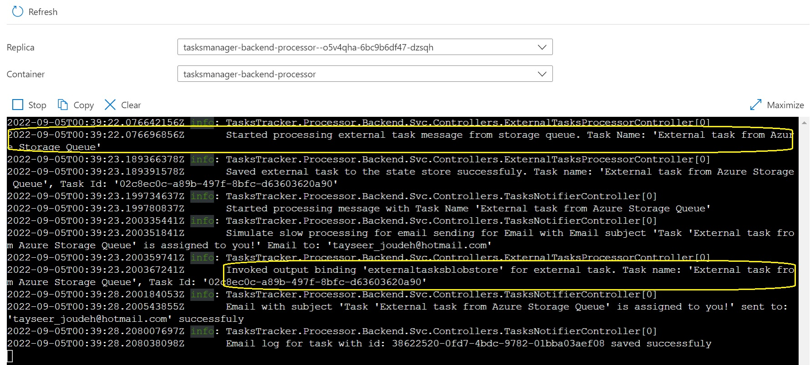

# Module 6 - ACA with Dapr Bindings Building Block

In this module, we are going to extend the backend background processor service named `ACA-Processor Backend`, we will rely on [Dapr Input and Output Bindings](https://docs.dapr.io/developing-applications/building-blocks/bindings/bindings-overview/) to achieve 3 scenarios as the following:

* Trigger a process on the `ACA-Processor Backend` based on a **message sent to a specific Azure Storage Queue**, this is a fictitious scenario but we will assume that this Azure Storage Queue is an external system to which external clients can submit tasks to this queue and our `ACA-Processor Backend` will be configured to trigger a certain process when a new message is received.
* From the service `ACA-Processor Backend` we will **invoke an external resource** that is storing the content of the incoming task from the external queue as a JSON blob file on Azure Storage Blobs.
* Remove the SendGrid SDK and specific code created in the previous module to send emails and replace it with [Dapr SendGrid output binding.](https://docs.dapr.io/reference/components-reference/supported-bindings/sendgrid/)
* Trigger a process on the `ACA-Processor Backend` based on a **configurable interval schedule**, this implements a background worker to wake up (at a regular interval) and check if tasks created are overdue and mark them as overdue, then store the updated state on Azure Cosmos DB. (Covered in the [next module](/aca/07-aca-cron-bindings/index.md))

Let's take a look at the high-level architecture diagram below to understand the flow of input and output bindings in Dapr:


Let's assume that there is a fictitious **external system** (outside of our Tasks Tracker microservice application which acts as 3rd party component) that needs to integrate with our Tasks Tracker microservice application, this external system can publish a message on Azure Storage Queue which contains information about a task that needs to be stored and maintained in our Tasks Tracker application, so our system needs to **react** when a message is added to the Azure Storage Queue.
To achieve this in a simple way and without writing a lot of plumbing code to access the Azure Storage Queue, our system will expose an event handler (aka **Input Binding**) that receives and processes the message coming to the storage queue. Once the processing of the message completes and we store the task into Cosmos DB, our system will **trigger** an event (aka **Output binding**) that invokes a fictitious external service that stores the content of the message into an Azure Blob Storage container. 

{: .note }
Those 3rd party external services could be a services hosted on another cloud provider, different Azure subscription or even on premise. Dapr bindings usually use to trigger your app with events coming in from external systems and interface with external systems. For simplicity of the workshop we are going to host those 2 fictitious services in the same subscription of our Tasks Tracker microservice application.

When I started looking at Dapr Bindings Building Block, I noticed a lot of similarities with the Pub/Sub Building Block we covered in the [previous module](../../aca/05-aca-dapr-pubsubapi/index.md). But remember that Pub/Sub Building Block is meant to be used for Async communication between services **within your solution**, the Binding Building Block has a wider scope and it mainly focuses on connectivity and interoperability across different systems, disparate applications, and services outside the boundaries of your own application. For a full list of [supported bindings](https://docs.dapr.io/reference/components-reference/supported-bindings/) visit this link.

### Overview of Dapr Bindings Building Block

Let's take a look at the detailed Dapr Binding Building Block architecture diagram that we are going to implement in this module to fulfill the use case we discussed earlier:


Looking at the diagram we notice the following:

* In order to receive events and data from the external resource (Azure Storage Queue) our `ACA-Processor Backend` service need to register a public endpoint that will become an event handler.
* This binding configuration between the external resource and our service will be configured by using the `Input Binding Confgiration yaml` file, the Dapr sidecar of the background service will read the configuration and subscribe to the endpoint defined for the external resource, in our case, it will be a specific Azure Storage Queue.
* When a message is published to the storage queue; the input binding component running in the Dapr sidecar picks it up and triggers the event.
* The Dapr sidecar invokes the endpoint (event handler defined in the `ACA-Processor Backend` Service) configured for the binding. In our case, it will be an endpoint that can be reached by invoking a `POST` operation `http://localhost:3502/ExternalTasksProcessor/Process` and the request body content will be the JSON payload of the published message to the Azure Storage Queue.
* When the event is handled in our `ACA-Processor Backend` and the business logic is completed, this endpoint needs to return an HTTP response with a `200 ok` status to acknowledge that processing is complete. If the event handling is not completed or there is an error, this endpoint should return HTTP 400 or 500 status code.
* In order to enable our service `ACA-Processor Backend` to trigger an event that invokes an external resource, we need to use the `Output Binding Configuration Yaml` file to configure the relation between our service and the external resource (Azure Blob Storage) and how to connect to it.
* Once the Dapr sidecar reads the binding configuration file, our service can trigger an event that invokes the output binding API on the Dapr sidecar, in our case, the event will be creating a new blob file containing the content of the message we read from the Azure Storage Queue.
* With this in place, our service `ACA-Processor Backend` is ready to invoke the external resource by sending a POST operation to the endpoint `http://localhost:3502/v1.0/bindings/ExternalTasksBlobstore` and the JSON payload will contain the below content, or we can use the Dapr client SDK to invoke this output biding to invoke the external service and store the file in Azure Blob Storage.

```json
{
    "data": "{
        "taskName": "Task Coming from External System",
        "taskAssignedTo": "user1@hotmail.com",
        "taskCreatedBy": "tjoudeh@bitoftech.net",
        "taskDueDate": "2022-08-19T12:45:22.0983978Z"
    }",
    "operation": "create"
}
```
Let's now update our Backend Background Processor project and define the input and output bindings configuration files and event handlers.

To proceed with this workshop we need to provision this fictitious external service (Azure Storage Account) to start responding to messages published to a queue and use the same storage account to store blob files as an external event. To do so, you can run the below PowerShell script to create Azure Storage Account and get the master key. Remember for a real world-scenario you will not provision those services, those are 3rd party services that wants to integrate with your solution.

{: .note }
We will be retrieving the storage account key for local dev testing purposes, and when deploying the changes to ACA, we are going to store the storage key securely into Azure Key Vault and use [Dapr Secrets Store Building Block with AKV](https://docs.dapr.io/reference/components-reference/supported-secret-stores/azure-keyvault/). We didn't use Manged Identity here because those services are not part of our solution, those could be a non AD compliant services or hosted on another cloud.

```powershell
$STORAGE_ACCOUNT_NAME = "<replace with unique storage name>"
  
az storage account create `
--name $STORAGE_ACCOUNT_NAME `
--resource-group $RESOURCE_GROUP `
--location $LOCATION `
--sku Standard_LRS `
--kind StorageV2
  
# list azure storage keys
az storage account keys list -g $RESOURCE_GROUP -n $STORAGE_ACCOUNT_NAME
```

### Updating the Backend Background Processor Project

##### 1. Create an event handler (API endpoint) to respond to messages published to Azure Storage Queue
Let's add an endpoint that will be responsible to handle the event when a message is published to Azure Storage Queue, this endpoint will start receiving the message published from the external service, to do so, add a new controller named `ExternalTasksProcessorController.cs` under `Controllers` folder and use the code below:

```csharp
namespace TasksTracker.Processor.Backend.Svc.Controllers
{
    [Route("ExternalTasksProcessor")]
    [ApiController]
    public class ExternalTasksProcessorController : ControllerBase
    {
        private readonly ILogger<ExternalTasksProcessorController> _logger;
        private readonly DaprClient _daprClient;

        public ExternalTasksProcessorController(ILogger<ExternalTasksProcessorController> logger,
                                                DaprClient daprClient)
        {
            _logger = logger;
            _daprClient = daprClient;
        }

        [HttpPost("process")]
        public async Task<IActionResult> ProcessTaskAndStore([FromBody] TaskModel taskModel)
        {
            try
            {
                _logger.LogInformation("Started processing external task message from storage queue. Task Name: '{0}'", taskModel.TaskName);

                taskModel.TaskId = Guid.NewGuid();
                taskModel.TaskCreatedOn = DateTime.UtcNow;

                //Dapr SideCar Invocation (save task to a state store)
                await _daprClient.InvokeMethodAsync(HttpMethod.Post, "tasksmanager-backend-api", $"api/tasks", taskModel);

                _logger.LogInformation("Saved external task to the state store successfully. Task name: '{0}', Task Id: '{1}'", taskModel.TaskName, taskModel.TaskId);
                
                //ToDo: code to invoke external binding and store queue message content into blob file in Azure storage

                return Ok();
            }
            catch (Exception)
            {
                throw;
            }
        }
    }
}
```

What we have added here is simple, we just defined an action method named `ProcessTaskAndStore` which can be accessed by sending HTTP POST operation on the endpoint `ExternalTasksProcessor/Process` and this action method accepts the TaskModel in the request body as JSON payload, this is what will be received from the external service (Azure Storage Queue). Within this action method, we are going to store the received task by sending a POST request to `/api/tasks` which is part of the backend api named `tasksmanager-backend-api`. Then we return `200 OK` to acknowledge that message received is processed successfully and should be removed from the external service queue.

##### 2. Create Dapr Input Binding Component file

Now we need to create the component configuration file which will describe the configuration and how our backend background processor will start handling events coming from the external service (Azure Storage Queues). To do so, add a new file named `dapr-bindings-in-storagequeue.yaml` under folder `components` and paste the below:

```yaml
apiVersion: dapr.io/v1alpha1
kind: Component
metadata:
  name: externaltasksmanager
spec:
  type: bindings.azure.storagequeues
  version: v1
  metadata:
  - name: storageAccount
    value: "<Your Storage Account Name>"
  - name: storageAccessKey
    value: "<Your Storage Account Key>" 
  - name: queue
    value: "external-tasks-queue"
  - name: decodeBase64
    value: "true"
  - name: route
    value: /externaltasksprocessor/process
```

The full specifications of yaml file with Azure Storage Queues can be found on [this link](https://docs.dapr.io/reference/components-reference/supported-bindings/storagequeues/), but let's go over the configuration we have added here:

* The type of binding is `bindings.azure.storagequeues`.
* The name of this input binding is `externaltasksmanager`.
* We are setting the `storageAccount` name, `storageAccessKey` value, and the `queue` name. Those properties will describe how the event handler we added can connect to the external service. You can create any queue you prefer on the Azure Storage Account we created to simulate an external system.
* We are setting the `route` property to the value `/externaltasksprocessor/process` which is the address of the endpoint we have just added so POST requests are sent to this endpoint.
* We are setting the property `decodeBase64` to `true` as the message queued in the Azure Storage Queue is Base64 encoded.

{: .note }
The value of the Metadata `storageAccessKey` is used as plain text here for local dev scenario, we will see how we are going to store this key securely in AKV and use Dapr Secrets Store API to read the access key.

##### 3. Create Dapr Output Binding Component file

Now we need to create the component configuration file which will describe the configuration and how our service `ACA-Processor Backend` will be able to invoke the external service (Azure Blob Storage) and be able to create and store a JSON blob file that contains the content of the message received from Azure Storage Queues. To do so, add a new file named `dapr-bindings-out-blobstorage.yaml` under folder `components` and paste the below:

```yaml
apiVersion: dapr.io/v1alpha1
kind: Component
metadata:
  name: externaltasksblobstore
spec:
  type: bindings.azure.blobstorage
  version: v1
  metadata:
  - name: storageAccount
    value: "<Your Storage Account Name>"
  - name: storageAccessKey
    value: "<Your Storage Account Key>" 
  - name: container
    value: "externaltaskscontainer"
  - name: decodeBase64
    value: false
```
The full specifications of yaml file with Azure blob storage can be found on [this link](https://docs.dapr.io/reference/components-reference/supported-bindings/blobstorage/), but let's go over the configuration we have added here:

* The type of binding is `bindings.azure.blobstorage`.
* The name of this output binding is `externaltasksblobstore`. We will use this name when we use the Dapr SDK to trigger the output binding.
* We are setting the `storageAccount` name, `storageAccessKey` value, and the `container` name. Those properties will describe how our backend background service will be able to connect to the external service and create a blob file. We will assume that there is a container already created on the external service and named `externaltaskscontainer` All our JSON blob files created will be under this container.
* We are setting the property `decodeBase64`  to `false` as we don’t want to encode file content to base64 images, we need to store the file content as is.

##### 5. Use Dapr client SDK to invoke the output binding
Now we need to invoke the output binding by using the .NET SDK, to do so, open the file named `ExternalTasksProcessorController.cs` and update the action method code as the below:

```csharp
[HttpPost("process")]
public async Task<IActionResult> ProcessTaskAndStore([FromBody] TaskModel taskModel)
{
    try
    {
        _logger.LogInformation("Started processing external task message from storage queue. Task Name: '{0}'", taskModel.TaskName);

        taskModel.TaskId = Guid.NewGuid();
        taskModel.TaskCreatedOn = DateTime.UtcNow;

        //Dapr SideCar Invocation (save task to a state store)
        await _daprClient.InvokeMethodAsync(HttpMethod.Post, "tasksmanager-backend-api", $"api/tasks", taskModel);

        _logger.LogInformation("Saved external task to the state store successfully. Task name: '{0}', Task Id: '{1}'", taskModel.TaskName, taskModel.TaskId);

//code to invoke external binding and store queue message content into blob file in Azure storage
        IReadOnlyDictionary<string,string> metaData = new Dictionary<string, string>()
            {
                { "blobName", $"{taskModel.TaskId}.json" },
            };

        await _daprClient.InvokeBindingAsync("externaltasksblobstore", "create", taskModel, metaData);

        _logger.LogInformation("Invoked output binding '{0}' for external task. Task name: '{1}', Task Id: '{2}'", OUTPUT_BINDING_NAME, taskModel.TaskName, taskModel.TaskId);

        return Ok();
    }
    catch (Exception)
    {
        throw;
    }
}
```

Looking at the code above, you will see that we calling the method `InvokeBindingAsync` and we are passing the binding name `externaltasksblobstore` defined in the configuration file, as well the second parameter `create` is the action we need to do against the external blob storage. You can for example delete or get a content of a certain file. For a full list of supported actions on Azure Blob Storage, [visit this link](https://docs.dapr.io/reference/components-reference/supported-bindings/blobstorage/#binding-support).

Notice how are setting the file name we are storing at the external service, we need the file names to be created using the same Task Identifier, all we need to do is to pass the key `blobName` with the file name values into the `metaData` dictionary.

##### 6. Test Dapr bindings locally

Now we are ready to give it an end-to-end test on our dev machines, to do so, run the 3 applications together using Debug and Run button from VS Code. You can read how we configured the 3 apps to run together in this [post](/aca/20-appendix/01-run-debug-dapr-app-vscode.md).

Open [Azure Storage Explorer](https://azure.microsoft.com/en-us/products/storage/storage-explorer/#overview), if you don't have it you can install it from [here](https://azure.microsoft.com/en-us/products/storage/storage-explorer/#overview). Login to your Azure Subscription and navigate to the storage account already created, create a queue, and use the same name you already used in the Dapr Input configuration file.

The content of the message that Azure Storage Queue excepts should be as below, so try to queue a new message using the tool as the image below:

```json
{
  "taskName": "Task from External System",
  "taskAssignedTo": "user1@hotmail.com",
  "taskCreatedBy": "tjoudeh@bitoftech.net",
  "taskDueDate": "2022-08-19T12:45:22.0983978Z"
}
```


If all is configured successfully you should be able to see a JSON file created as a blob in the Azure Storage Container named `externaltaskscontainer` based on your configuration.


### Use Dapr SendGrid Output Bindings

In the previous module we've seen how we are sending notification emails when a task is assigned to a user by installing the SendGrid SDK NuGet package and writing some custom code to trigger sending emails. Dapr Can simplify this process by using the [Dapr SendGrid Output binding component](https://docs.dapr.io/reference/components-reference/supported-bindings/sendgrid/), so let's see how we can simplify this and remove the external SendGrid SDK.

##### 1. Create Dapr SendGrid Output Binding Component file
We need to create the component configuration file which will describe the configuration and how our service `ACA-Processor Backend` will be able to invoke SendGrid service and notify the task owner by email. To do so, add a new file named `dapr-bindings-out-sendgrid.yaml` under folder `components` and paste the below:

```yaml
apiVersion: dapr.io/v1alpha1
kind: Component
metadata:
  name: sendgrid
spec:
  type: bindings.twilio.sendgrid
  version: v1
  metadata:
  - name: emailFrom
    value: "<Your email from white listed with SendGrid when you obtained the API Key>"
  - name: emailFromName
    value: "Tasks Tracker Notification"
  - name: apiKey
    value: "<Send Grid API Key>"
```
The full specifications of yaml file with SendGrid binding can be found on [this link](https://docs.dapr.io/reference/components-reference/supported-bindings/sendgrid/#component-format), but let's go over the configuration we have added here:

* The type of binding is `bindings.twilio.sendgrid`.
* The name of this output binding is `sendgrid`. We will use this name when we use the Dapr SDK to trigger the output binding.
* We are setting the metadata `emailFrom`, `emailFromName`, and the `apiKey`. Those properties will describe how our backend background service will be able to connect to SendGrid API and send the email.

##### 2. Remove SendGrid package reference
Open file `TasksTracker.Processor.Backend.Svc.csproj` and remove the NuGet package reference `PackageReference Include="SendGrid" Version="9.28.1"`, with Dapr SendGrid Output bindings there is no need to bring external SDKs.

##### 3. Update SendEmail code to use Output bindings instead of SendGrid SDK
Now we need to invoke the SendGrid output binding by using the Dapr .NET SDK, to do so, open the file named `TasksNotifierController.cs` and update the action method `TaskSaved` and `SendEmail` method code as the below:

```csharp
[Dapr.Topic("dapr-pubsub-servicebus", "tasksavedtopic")]
[HttpPost("tasksaved")]
public async Task<IActionResult> TaskSaved([FromBody] TaskModel taskModel)
{
    _logger.LogInformation("Started processing message with Task Name '{0}'", taskModel.TaskName);

    var sendGridResponse = await SendEmail(taskModel);

    if (sendGridResponse)
    {
        return Ok();
    }

    return BadRequest("Failed to send an email");
}

private async Task<bool> SendEmail(TaskModel taskModel)
{
    var integrationEnabled = _config.GetValue<bool>("SendGrid:IntegrationEnabled");
    var sendEmailResponse = true;
    var subject = $"Task '{taskModel.TaskName}' is assigned to you!";
    var plainTextContent = $"Task '{taskModel.TaskName}' is assigned to you. Task should be completed by the end of: {taskModel.TaskDueDate.ToString("dd/MM/yyyy")}";

    try
    {
        //Send actual email using Dapr SendGrid Outbound Binding (Disabled when running load test)
        if (integrationEnabled)
        {
            IReadOnlyDictionary<string, string> metaData = new Dictionary<string, string>()
        {
            { "emailTo", taskModel.TaskAssignedTo },
            { "emailToName", taskModel.TaskAssignedTo },
            { "subject", subject }
        };
            await _daprClient.InvokeBindingAsync("sendgrid", "create", plainTextContent, metaData);
        }
        else
        {
            //Introduce artificial delay to slow down message processing
            _logger.LogInformation("Simulate slow processing for email sending for Email with Email subject '{0}' Email to: '{1}'", subject, taskModel.TaskAssignedTo);
            Thread.Sleep(5000);
        }

        if (sendEmailResponse)
        {
            _logger.LogInformation("Email with subject '{0}' sent to: '{1}' successfully", subject, taskModel.TaskAssignedTo);
        }
    }
    catch (System.Exception ex)
    {
        sendEmailResponse = false;
        _logger.LogError(ex, "Failed to send email with subject '{0}' To: '{1}'.", subject, taskModel.TaskAssignedTo);
        throw;
    }
    return sendEmailResponse;
}
```

Looking at the code above, you will see that we calling the method `InvokeBindingAsync` and we are passing the binding name `sendgrid` defined in the configuration file, as well the second parameter `create` is the action we need to do trigger email sending using SendGrid. For a full list of supported actions on SendGrid outbound binding spec, [visit this link](https://docs.dapr.io/reference/components-reference/supported-bindings/sendgrid/#binding-support).

Notice how are setting the recipient, display name, and email subject by passing the setting the keys `emailTo`, `emailToName`, and `subject` into the `metaData` dictionary.

### Configure Dapr secret store component with Azure Key Vault
Currently we have 3 Dapr components which are not Azure AD enabled services, as we saw on the previous component files, we are storing sensitive keys to access those external services. The recommended approach for retrieving these secrets is to reference an existing Dapr secret store component that securely accesses secret information.

To do this we need Create a [Dapr secret store component](https://docs.dapr.io/developing-applications/building-blocks/secrets/secrets-overview/) using the Container Apps schema The component type. The Dapr secret store will be configured with [Azure Key Vault secret store](https://docs.dapr.io/reference/components-reference/supported-secret-stores/azure-keyvault/).

##### 1. Create an Azure Key Vault resource
First thing we need to do is to create an Azure Key Vault which will be used to store securely any secret or key used in our application, to do so, run the below command:

```powershell
$KEYVAULTNAME = "<your akv name>"
az keyvault create `
--name $KEYVAULTNAME `
--resource-group $RESOURCE_GROUP `
--enable-rbac-authorization true `
--location $LOCATION
```
{: .note }
It is important to create the Azure Key Vault with Azure RBAC for authorization by setting `--enable-rbac-authorization true` because thr role we are going to assign to the Azure AD application will work only when RBAC authorization is enabled.

##### 2. Grant Backend Processor App a Role to read secrets from Azure Key Vault
In the previous module we have configured the `system-assigned` identity for the service `ACA-Processor Backend`. Now we need to assign a role named `Key Vault Secrets User` to it so it access and read secrets from Azure Key Vault.

You can read more about [Azure built-in roles for Key Vault data plane operations](https://learn.microsoft.com/en-us/azure/key-vault/general/rbac-guide?tabs=azure-cli#azure-built-in-roles-for-key-vault-data-plane-operations) Run the command below: 

```powershell
$KV_SECRETSUSER_ROLEID = "4633458b-17de-408a-b874-0445c86b69e6" # ID for 'Key Vault Secrets User' Role
$subscriptionID= az account show --query id -o tsv

$BACKEND_SVC_PRINCIPALID = az containerapp show ` # Get PRINCIPALID of BACKEND Processor Service
-n $BACKEND_SVC_NAME `
-g $RESOURCE_GROUP `
--query identity.principalId

az role assignment create `
--role $KV_SECRETSUSER_ROLEID `
--assignee $BACKEND_SVC_PRINCIPALID `
--scope "/subscriptions/$subscriptionID/resourcegroups/$RESOURCE_GROUP/providers/Microsoft.KeyVault/vaults/$KEYVAULTNAME"
```

##### 3. Create secrets in the Azure Key Vault
To create a secret in Azure Key Vault you need to have a role which allow you to create secrets, from the Azure CLI we will assign the role `Key Vault Secrets Officer` to the user signed in to AZ CLI to be able to create secrets. To do use the script below:
```powershell
$SIGNEDIN_UERID =  az ad signed-in-user show --query id
$KV_SECRETSOFFICER_ROLEID = "b86a8fe4-44ce-4948-aee5-eccb2c155cd7" #ID for 'Key Vault Secrets Office' Role 

az role assignment create --role $KV_SECRETSOFFICER_ROLEID `
--assignee $SIGNEDIN_UERID `
--scope "/subscriptions/$subscriptionID/resourcegroups/$RESOURCE_GROUP/providers/Microsoft.KeyVault/vaults/$KEYVAULTNAME"
```

Now we will create 2 secrets in the Azure Key Vault as the below command:
```powershell
# Set SendGrid API Key as a secret named 'sendgrid-api-key'
az keyvault secret set `
--vault-name $KEYVAULTNAME `
--name "sendgrid-api-key" `
--value "<Send Grid API Key>"

# Set External Azure Storage Access Key as a secret named 'external-azure-storage-key'
az keyvault secret set `
--vault-name $KEYVAULTNAME `
--name "external-azure-storage-key" `
--value "<Your Storage Account Key>"
```

##### 4. Create a ACA Dapr Secrets Store Component file
Create a new yaml file named `containerapps-secretstore-kv.yaml` and add it under folder `aca-components`, use the file content below:
```yaml
componentType: secretstores.azure.keyvault
version: v1
metadata:
  - name: vaultName
    value: tasks-tracker-akv
scopes:
  - tasksmanager-backend-processor
```
Things to notice here:
- We didn't specify the component name `secretstoreakv` when we created this component file, we are going to specify it once we add this dapr component to Azure Container Apps Environment via CLI.
- We are not referencing any service bus connection strings as the authentication between Dapr and Azure Service Bus will be configured using Managed Identities. 
- The metadata `vaultName` value is set to the name of the Azure Key Vault we've just created. 
- We are allowing this component only to be accessed by the dapr with application id `tasksmanager-backend-processor`. This means that our Backend API or Frontend Web App services will not be able to access the Dapr secret store. If we want to allow them we need to update this component file and grant the system-identity of those services a `Key Vault Secrets User` role.

##### 5. Create Input and Output Binding Component files matching Azure Container Apps Specs

Go ahead and add a new file named `containerapps-bindings-in-storagequeue.yaml` under the folder `aca-components` use the yaml below:
```yaml
componentType: bindings.azure.storagequeues
version: v1
secretStoreComponent: "secretstoreakv"
metadata:
- name: storageAccount
  value: "<Your Storage Account Name>"
- name: storageAccessKey
  secretRef: external-azure-storage-key
- name: queue
  value: "external-tasks-queue"
- name: decodeBase64
  value: "true"
- name: route
  value: /externaltasksprocessor/process        
scopes:
- tasksmanager-backend-processor
```
The properties of this file is matching the ones used in Dapr component-specific file, it is a component of type `indings.azure.storagequeues`.
The only differences are the following: 
- We are setting the property `secretStoreComponent` value to `secretstoreakv` which is the name of Dapr secret store component.
- We are using `secretRef` when setting the metadata `storageAccessKey`. The value `external-azure-storage-key` represents the AKV secret created earlier.

Let's add a new file named `containerapps-bindings-out-blobstorage.yaml` under the folder `aca-components` and paste the code below:
```yaml
componentType: bindings.azure.blobstorage
version: v1
secretStoreComponent: "secretstoreakv"
metadata:
- name: storageAccount
  value: "<Your Storage Account Name>"
- name: storageAccessKey
  secretRef: external-azure-storage-key
- name: container
  value: "externaltaskscontainer"
- name: decodeBase64
  value: "false"
- name: publicAccessLevel
  value: "none"
scopes:
- tasksmanager-backend-processor
```

The properties of this file is matching the ones used in Dapr component-specific file, it is a component of type `indings.azure.blobstorage`.
The only differences are the following: 
- We are setting the property `secretStoreComponent` value to `secretstoreakv` which is the name of Dapr secret store component.
- We are using `secretRef` when setting the metadata `storageAccessKey`. The value `external-azure-storage-key` represents the AKV secret created earlier.

##### 6. Create SendGrid Output Binding Component file matching Azure Container Apps Specs
Add a new file named `containerapps-bindings-out-sendgrid.yaml` under the folder `aca-components` use the yaml below:
```yaml
componentType: bindings.twilio.sendgrid
version: v1
secretStoreComponent: "secretstoreakv"
metadata:
- name: emailFrom
  value: "mail@gmail.com"
- name: emailFromName
  value: "Tasks Tracker Notification"
- name: apiKey
  secretRef: sendgrid-api-key
scopes:
- tasksmanager-backend-processor
```
The properties of this file similar to the previous ones, the difference that the metadata 'apiKey' value is set to `sendgrid-api-key` which is the name of the secret in AKV that holds SendGrid API key.

With those changes in place, we are ready to rebuild the backend background processor container image, update Azure Container Apps Env, and redeploy a new revision.

### Deploy a new reversion of the Backend Background Processor App to ACA

##### 1. Build the Backend Background Processor image and push it to ACR
As we have done previously we need to build and deploy Backend Background Processor image to ACR so it is ready to be deployed to ACA, to do so, continue using the same PowerShell console and paste the code below (Make sure you are on directory `TasksTracker.ContainerApps`):

```powershell
az acr build --registry $ACR_NAME --image "tasksmanager/$BACKEND_SVC_NAME" --file 'TasksTracker.Processor.Backend.Svc/Dockerfile' .
```

##### 2. Add Dapr Secret Store Component to ACA Environment
We need to run the command below to create the Dapr secret store component:
```powershell
az containerapp env dapr-component set `
--name $ENVIRONMENT --resource-group $RESOURCE_GROUP `
--dapr-component-name secretstore `
--yaml '.\aca-components\containerapps-secretstore-kv.yaml'
```

##### 3. Add 3 Bindings Dapr Components to ACA Environment
Next, we will add create the 3 Dapr bindings components using the component files created, run the commands below:

```powershell
##Input binding component for Azure Storage Queue
az containerapp env dapr-component set `
  --name $ENVIRONMENT --resource-group $RESOURCE_GROUP `
  --dapr-component-name externaltasksmanager `
  --yaml '.\aca-components\containerapps-bindings-in-storagequeue.yaml'
 
##Output binding component for Azure Blob Storage
az containerapp env dapr-component set `
 --name $ENVIRONMENT --resource-group $RESOURCE_GROUP `
  --dapr-component-name externaltasksblobstore `
 --yaml '.\aca-components\containerapps-bindings-out-blobstorage.yaml'

##Output binding component for SendGrid
az containerapp env dapr-component set `
 --name $ENVIRONMENT --resource-group $RESOURCE_GROUP `
  --dapr-component-name sendgrid `
 --yaml '.\aca-components\containerapps-bindings-out-sendgrid.yaml'
```
{: .note }
Executing those commands should be similar to create any component using yaml file. But there is an [issue on the CLI](https://github.com/microsoft/azure-container-apps/issues/643) when trying to create a component file which contains reference to a `secretStoreComponent` via CLI. Until this issue is fixed, we are going to create the 3 components from the Azure Portal.

To do this from Azure Portal, navigate to your Container Apps Environment, select `Dapr Components`, then click on `Add` component, and provide the values of the component as the image below, I will be showing the component `externaltasksmanager` and you can do the other 2 components (`externaltasksblobstore` and `sendgrid`) using the values in the yaml file for each component.


##### 4. Deploy new revisions of the Backend Background Processor to ACA
As we've done multiple times, we need to update the Azure Container App hosting the Backend Background Processor with a new revision so our code changes are available for end users, notice how we are removing the environments variable named `SendGrid__ApiKey` as we are reading the key value from Dapr secret store. To do so run the below PowerShell script:
```powershell
## Update Backend Background Processor container app and create a new revision 
az containerapp update `
--name $BACKEND_SVC_NAME `
--resource-group $RESOURCE_GROUP `
--revision-suffix v20230224-1 `
--remove-env-vars "SendGrid__ApiKey"
```
##### 5. Remove SendGrid secret from the Backend Background Processor App
Lastly, it is better to remove the secret stored in `Secrets` of the Backend Background Processor as this secret is not used anymore. To do so run the following command:
```powershell
az containerapp secret remove --name $BACKEND_SVC_NAME `
--resource-group $RESOURCE_GROUP `
--secret-names "sendgrid-apikey"
```
With those changes in place and deployed, from the Azure Portal, you can open the log streams of the container app hosting the `ACA-Processor-Backend` and check the logs generated after queuing a message into Azure Storage Queue as an external system, you should receive logs similar to the below


In the next module, we will cover a special type of Dapr input binding named Cron Binding.