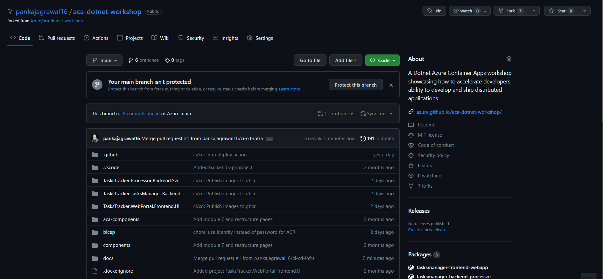

# Deploy Infrastructure Using GitHub Actions

!!! info "Module Duration"
    30 minutes

In the [previous section](../../aca/10-aca-iac-bicep/iac-bicep.md), we demonstrated how Bicep scripts can be used to automate the deployment of infrastructure components. However, creating the container registry and deploying the Bicep scripts using the Azure CLI still required manual effort. For a more efficient and streamlined process, it's preferable to use automation. GitHub Actions is a great solution for automating workflows, and in this section, we'll explain how to create a GitHub Action workflow for deploying the infrastructure components of our application.

The workshop repository contains a GitHub Action workflow file that will be used to deploy the infrastructure components of our application. Follow the steps below to create a GitHub Action workflow to deploy the infrastructure components of our application.

### Fork the GitHub repository

Start by forking the workshop repository to your GitHub account. Follow the steps below to fork the workshop:

1. Navigate to the workshop repository at [:material-github: Azure/aca-dotnet-workshop](https://github.com/Azure/aca-dotnet-workshop){target=_blank}
2. Click the **Fork** button in the top-right corner of the page.
3. Select your GitHub account to fork the repository to.
4. Wait for the repository to be forked.

### Configure Repository for OIDC Authentication with Azure AD

In order to use the GitHub Actions workflow to deploy the infrastructure components of our application, we need to log in to Azure using the Azure CLI with [Azure login](https://github.com/marketplace/actions/azure-login) action.

The Azure login action supports two different ways of authenticating with Azure:

- [Service principal with secrets](https://learn.microsoft.com/en-us/azure/developer/github/connect-from-azure?tabs=azure-portal%2Clinux#use-the-azure-login-action-with-a-service-principal-secret)
- [OpenID Connect (OIDC) with a Azure service principal using a Federated Identity Credential](https://learn.microsoft.com/en-us/azure/developer/github/connect-from-azure?tabs=azure-portal%2Clinux#use-the-azure-login-action-with-openid-connect)

In this workshop, we will use the OIDC authentication method. Assuming you are already logged in using azure cli locally, follow the steps below to configure the repository for OIDC authentication with Azure AD either using powershell or bash/wsl:

=== "PowerShell"

    - Execute the following commands in PowerShell to create an Azure AD application and service principal.

    ```powershell
    $AZURE_TENANT = az account show -o tsv --query tenantId
    $SUBSCRIPTION_ID = az account show -o tsv --query id
    
    $APP_ID = az ad app create --display-name aca-dotnet-workshop-oidc --query appId -otsv
    
    az ad sp create --id $APP_ID --query appId -otsv
    
    $OBJECT_ID = az ad app show --id $APP_ID --query id -otsv
    ```
    
    - Execute below command to create a federated identity credential for the Azure AD application.

    !!! note
        Replace `<Repo owner>` in below json with your GitHub username where you forked the workshop repository.

    ```powershell
    az rest --method POST --uri "https://graph.microsoft.com/beta/applications/$OBJECT_ID/federatedIdentityCredentials" --body '{\"name\":\"aca-dotnet-workshop-federated-identity\",\"issuer\":\"https://token.actions.githubusercontent.com\",\"subject\":\"repo:<Repo owner>/aca-dotnet-workshop:ref:refs/heads/main\",\"description\":\"GitHub\",\"audiences\":[\"api://AzureADTokenExchange\"]}' --headers "Content-Type=application/json"
    ```
    
    - Perform role assignment for the Azure AD application to access the subscription.

    ```powershell
    az role assignment create --assignee $APP_ID --role contributor --scope /subscriptions/$SUBSCRIPTION_ID
    az role assignment create --assignee $APP_ID --role 'User Access Administrator' --scope /subscriptions/$SUBSCRIPTION_ID
    ```

=== "Bash/WSL"

    - Execute the following commands in PowerShell to create an Azure AD application and service principal.
    
    ```bash
    AZURE_TENANT = $(az account show -o tsv --query tenantId)
    SUBSCRIPTION_ID = $(az account show -o tsv --query id)

    APP_ID = $(az ad app create --display-name serverless-webapp-kotlin-oidc --query appId -otsv)

    az ad sp create --id $APP_ID --query appId -otsv

    OBJECT_ID = $(az ad app show --id $APP_ID --query id -otsv)
    ```

    - Execute below command to create a federated identity credential for the Azure AD application.

    !!! note
        Replace `<Repo owner>` in below json with your GitHub username where you forked the workshop repository.

    ```bash
    cat <<EOF > body.json
    {
        "name": "aca-dotnet-workshop-federated-identity",
        "issuer": "https://token.actions.githubusercontent.com",
        "subject": "repo:<Repo owner>/aca-dotnet-workshop:ref:refs/heads/main",
        "description": "GitHub",
        "audiences": [
            "api://AzureADTokenExchange"
        ]
    }
    EOF

    az rest --method POST --uri "https://graph.microsoft.com/beta/applications/$OBJECT_ID/federatedIdentityCredentials" --body @body.json
    ```

    - Perform role assignment for the Azure AD application to access the subscription.

    ```bash
    az role assignment create --assignee $APP_ID --role contributor --scope /subscriptions/$SUBSCRIPTION_ID
    az role assignment create --assignee $APP_ID --role 'User Access Administrator' --scope /subscriptions/$SUBSCRIPTION_ID
    ```

### Configure GitHub Repository Secrets

Configure secrets details in GitHub repo as described here in [create GitHub secrets](https://learn.microsoft.com/en-us/azure/developer/github/connect-from-azure?tabs=azure-cli%2Clinux#create-github-secrets). Use below values mapped to relevant secrets in GitHub.

    ```bash
    # AZURE_SUBSCRIPTION_ID
    echo $SUBSCRIPTION_ID
    # AZURE_TENANT_ID
    echo $AZURE_TENANT
    # AZURE_CLIENT_ID
    echo $APP_ID
    ```

### Configure GitHub Repository Variables

Configure repository variables in GitHub repo as described here in [create GitHub variables](https://docs.github.com/en/actions/learn-github-actions/variables). Use below values mapped to relevant variables in GitHub.

    ```bash 
    # LOCATION: Azure region where resources will be deployed
    LOCATION=<location. e.g. eastus>
    
    # RESOURCE_GROUP: Name of the resource group which will be created and resources will be deployed
    RESOURCE_GROUP=<resource group name>
    
    # (OPTIONAL)CONTAINER_REGISTRY_NAME: Unique name of the container registry which will be created and where images will be imported
    CONTAINER_REGISTRY_NAME=<container registry name>
    ```

!!! note

    Repository variables `CONTAINER_REGISTRY_NAME` is only needed by workflow, if you wish the images to be deployed from private ACR.
    
    You may chose to skip defining this variable and the workflow will use the [public github container registry images](https://github.com/orgs/Azure/packages?repo_name=aca-dotnet-workshop) to deploy the images.

### Trigger GitHub Actions Workflow

With these steps completed, you are now ready to trigger the GitHub Actions workflow named **Build and deploy infrastructure as code to Azure** using **workflow dispatch** to deploy the infrastructure components of the application.

!!! success

    Your GitHub Actions workflow should be triggered and the infrastructure components of our application should be deployed successfully.

    

??? info "Want to delete the resources deployed by the workflow?"

    Trigger the workflow again using **workflow dispatch** and select **checkbox** option.

    
