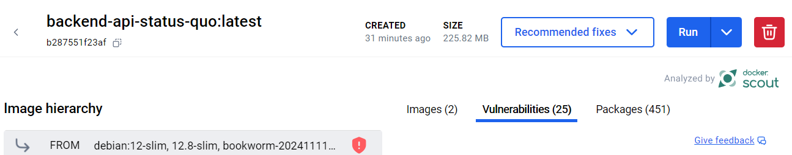
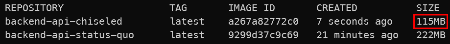

# Module 12 - Container Optimization

!!! info "Module Duration"
    45-60 minutes

## Objective

In this module, we will accomplish two objectives:

1. Learn how to reduce container footprints.
1. Build & deploy updated, optimized images to Azure.

## Module Sections

--8<-- "snippets/restore-variables.md"

### 1. Optimizing Containers

Azure Container Apps makes it simple to quickly become effective with containers. But even a managed container platform requires hygiene and can benefit greatly from smaller containers.  

In this module, we will look into the benefits of optimized containers such as:

- Smaller images to store and transfer to and from the container registry.
- Potentially less *Common Vulnerabilities and Exposures (CVEs)*.
- No bloat and unnecessary components such as shells, package managers, etc.

While available prior to .NET 8, the general availability introduction of .NET 8 in November 2023 came with an expanded focus on container optimization and a move away from general-purpose containers. You can apply similar steps for .NET versions newer than 8, but we omit them here for brevity.

Please ensure you have the Docker daemon ready. Running *Docker Desktop* does it.

#### 1.1 The Status Quo

Let's focus on our first project, the Backend API. This is an ASP.NET Core application.

Our original `Dockerfile` looks like this:

=== "Backend.Api Dockerfile"
```Dockerfile
--8<-- "docs/aca/12-optimize-containers/Backend.Api.Dockerfile"
```

```shell
cd ~\TasksTracker.ContainerApps
```

```shell
docker build -t backend-api-status-quo -f .\TasksTracker.TasksManager.Backend.Api\Dockerfile .

docker image list
```

This yields a sizable image at **222 MB**!


This image is comprised of two images, 452 packages, and has 19 vulnerabilities.



#### 1.2. Chiseled Images

Microsoft and Ubuntu's creator, Canonical, collaborated on the concept of a [chiseled image for .NET](https://learn.microsoft.com/en-us/dotnet/core/docker/container-images#scenario-based-images){target=_blank}. Take a general-purpose base image and start chiseling away until you are left with an image that contains nothing more than the bare necessities to run your workload. No shell, no package manager, no bloat.

=== "Backend.Api Dockerfile.chiseled"
```Dockerfile hl_lines="1 8"
--8<-- "docs/aca/12-optimize-containers/Backend.Api.Dockerfile.chiseled"
```

Create a new file, `Dockerfile.chiseled` in the Backend Api root directory, then build the image again:

```shell
docker build -t backend-api-chiseled -f .\TasksTracker.TasksManager.Backend.Api\Dockerfile.chiseled .

docker image list
```

Our image now stands at a much smaller **115 MB** - a drop of 107 MB and a size just 51.8% of the status quo image!



This image is comprised of one image, 331 packages, and has five vulnerabilities.


#### 1.3 Chiseled & Ahead-of-time (AOT) Compilation

[Ahead-of-time (AOT) compilation](https://learn.microsoft.com/en-us/dotnet/core/deploying/native-aot){target_blank} was first introduced with .NET 7. AOT compiles the application to native code instead of Intermediate Language (IL). This means that we must have foresight as to what platform will be hosting the application. Our process is simplified by the fact that containers in Azure Container Apps are only Linux-hosted. By using native code, we will bypass the just-in-time (JIT) compiler when the container executes, which means we will have faster startup and a smaller memory footprint. It also means these images can run in environments where JIT compilation may not be permitted.

=== "Backend.Api Dockerfile.chiseled.aot"
```Dockerfile hl_lines="1 8"
--8<-- "docs/aca/12-optimize-containers/Backend.Api.Dockerfile.chiseled.aot"
```

Create a new file, `Dockerfile.chiseled.aot` in the Backend Api root directory, then build the image again:

```shell
docker build -t backend-api-chiseled-aot -f .\TasksTracker.TasksManager.Backend.Api\Dockerfile.chiseled.aot .

docker image list
```

!!! note "Nightly Images"

    As the name implies, these images are produced nightly. They are not yet images that are versioned and stable in the registry. Your mileage may vary.

Another massive reduction takes the image down to a mere **16 MB** - a total drop of 206 MB and a size just 7.2% of the status quo image!


This image is comprised of one image, just 23 packages, and has nine vulnerabilities.  
Notably, the four additional vulnerabilities are in the `openssl 3.0.2` package in this image.


#### 1.4 Deploying the new Status Quo

While the image is vastly reduced, what hasn't changed is the functionality of the API. Whether you are executing it locally or deploying to Azure, the Backend API will continue to function as it always has. However, now it has less vulnerabilities, less time to transfer from the registry, less startup time, and less of a memory footprint. Furthermore, 16 MB is the uncompressed image. With compression, we are likely to continue dropping in size.

Let's update our existing Backend API container app with a new build and revision:

```shell hl_lines="6"
## Build Backend Service on ACR and Push to ACR

az acr build `
--registry $AZURE_CONTAINER_REGISTRY_NAME `
--image "tasksmanager/$BACKEND_API_NAME" `
--file 'TasksTracker.TasksManager.Backend.Api/Dockerfile.chiseled.aot' . 

# Update Backend API App container app and create a new revision 
az containerapp update `
--name $BACKEND_API_NAME  `
--resource-group $RESOURCE_GROUP `
--revision-suffix v$TODAY-6 `
--set-env-vars "ApplicationInsights__InstrumentationKey=secretref:appinsights-key"
```

Verify that the application continues to work:

```shell
$FRONTEND_UI_BASE_URL
```

### 2. Optimizing Frontend UI & Backend Service Containers

As all three projects use ASP.NET Core, we can follow the same approach with these two projects as well.how much you are able to reduce!

#### 2.1 Frontend UI

#### 2.1.1 The Status Quo

Our original `Dockerfile` looks like this:

=== "Frontend.Ui Dockerfile"
```Dockerfile
--8<-- "docs/aca/12-optimize-containers/Frontend.Ui.Dockerfile"
```

```shell
cd ~\TasksTracker.ContainerApps
```

```shell
docker build -t frontend-ui-status-quo -f .\TasksTracker.WebPortal.Frontend.Ui\Dockerfile .

docker image list
```

This yields an image size of **227 MB**.

#### 2.1.2 Chiseled & Ahead-of-time (AOT) Compilation

Skipping straight to AOT images:

=== "Frontend.Ui Dockerfile.chiseled.aot"
```Dockerfile hl_lines="1 8"
--8<-- "docs/aca/12-optimize-containers/Frontend.Ui.Dockerfile.chiseled.aot"
```

Create a new file, `Dockerfile.chiseled.aot` in the Frontend Ui root directory, then build the image again:

```shell
docker build -t frontend-ui-chiseled-aot -f .\TasksTracker.WebPortal.Frontend.Ui\Dockerfile.chiseled.aot .

docker image list
```

This much-improved image is now **20.6 MB**.

#### 2.2 Backend Service

#### 2.2.1 The Status Quo

Our original `Dockerfile` looks like this:

=== "Backend.Svc Dockerfile"
```Dockerfile
--8<-- "docs/aca/12-optimize-containers/Backend.Svc.Dockerfile"
```

```shell
cd ~\TasksTracker.ContainerApps
```

```shell
docker build -t backend-svc-status-quo -f .\TasksTracker.Processor.Backend.Svc\Dockerfile .

docker image list
```

This yields an image size of **222 MB**.

#### 2.2.2 Chiseled & Ahead-of-time (AOT) Compilation

Skipping straight to AOT images:

=== "Backend.Svc Dockerfile.chiseled.aot"
```Dockerfile hl_lines="1 8"
--8<-- "docs/aca/12-optimize-containers/Backend.Svc.Dockerfile.chiseled.aot"
```

Create a new file, `Dockerfile.chiseled.aot` in the Backend Svc root directory, then build the image again:

```shell
docker build -t backend-svc-chiseled-aot -f .\TasksTracker.Processor.Backend.Svc\Dockerfile.chiseled.aot .

docker image list
```

This much-improved image is now **16 MB**.

### 3. Optimization Summary

#### 3.1 Table of Improvements

The Backend API and the Backend Svc projects are all but identical while the Frontend UI project is just slightly larger. All three projects were cut down to less than 10% of their original size!

|                            | Image Size | Size Reduction | Size compared to Original | Packages | CVEs |
|----------------------------|-----------:|---------------:|--------------------------:|---------:|-----:|
| Backend API Original       |     222 MB |                |                           |      452 |   19 |
| Backend API Chiseled & AOT |      16 MB |         206 MB |                      7.2% |       23 |    9 |
| Frontend UI Original       |     226 MB |                |                           |      447 |   19 |
| Frontend UI Chiseled & AOT |      21 MB |         205 MB |                      9.3% |       18 |    9 |
| Backend Svc Original       |     222 MB |                |                           |      452 |   19 |
| Backend Svc Chiseled & AOT |      16 MB |         206 MB |                      7.2% |       23 |    9 |

#### 3.2 Build & Deploy All Services

The last step is to build & deploy updated images. For good measure, let's do the Backend API as well even though we did it earlier already.

```shell hl_lines="5 11 17"
# Build Backend API on ACR and Push to ACR
az acr build `
--registry $AZURE_CONTAINER_REGISTRY_NAME `
--image "tasksmanager/$BACKEND_API_NAME" `
--file 'TasksTracker.TasksManager.Backend.Api/Dockerfile.chiseled.aot' . 

# Build Backend Service on ACR and Push to ACR
az acr build `
--registry $AZURE_CONTAINER_REGISTRY_NAME `
--image "tasksmanager/$BACKEND_SERVICE_NAME" `
--file 'TasksTracker.Processor.Backend.Svc/Dockerfile.chiseled.aot' .

# Build Frontend Web App on ACR and Push to ACR
az acr build `
--registry $AZURE_CONTAINER_REGISTRY_NAME `
--image "tasksmanager/$FRONTEND_WEBAPP_NAME" `
--file 'TasksTracker.WebPortal.Frontend.Ui/Dockerfile.chiseled.aot' .
```

```shell
# Update Backend API App container app and create a new revision 
az containerapp update `
--name $BACKEND_API_NAME  `
--resource-group $RESOURCE_GROUP `
--revision-suffix v$TODAY-7 `
--set-env-vars "ApplicationInsights__InstrumentationKey=secretref:appinsights-key"

# Update Frontend Web App container app and create a new revision 
az containerapp update `
--name $FRONTEND_WEBAPP_NAME  `
--resource-group $RESOURCE_GROUP `
--revision-suffix v$TODAY-7 `
--set-env-vars "ApplicationInsights__InstrumentationKey=secretref:appinsights-key"

# Update Backend Background Service container app and create a new revision 
az containerapp update `
--name $BACKEND_SERVICE_NAME `
--resource-group $RESOURCE_GROUP `
--revision-suffix v$TODAY-7 `
--set-env-vars "ApplicationInsights__InstrumentationKey=secretref:appinsights-key"
```

Verify that the application continues to work with the three much smaller containers:

```shell
$FRONTEND_UI_BASE_URL
```

--8<-- "snippets/persist-state.md:module12"

## Review

In this module, we have accomplished two objectives:

1. Learned how to reduce container footprints.
1. Built & deployed updated, optimized images to Azure.
