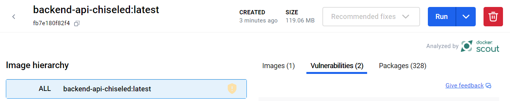

# Module 12 - Container Optimization

!!! info "Module Duration"
    45-60 minutes

## Objective

In this module, we will accomplish two objectives:

1. Learn how to reduce container footprints.
1. Build & deploy updated, optimized images to Azure.

## Module Sections

--8<-- "snippets/restore-variables.md"

### 1. Optimizing Containers

Azure Container Apps makes it simple to quickly become effective with containers. But even a managed container platform requires hygiene and can benefit greatly from smaller containers.

In this module, we will look into the benefits of optimized containers such as:

- Smaller images to store and transfer to and from the container registry.
- Potentially less *Common Vulnerabilities and Exposures (CVEs)*.
- No bloat and unnecessary components such as shells, package managers, etc.

While available prior to .NET 8, the general availability introduction of .NET 8 in November 2023 came with an expanded focus on container optimization and a move away from general-purpose containers. You can apply similar steps for .NET versions newer than 8, but we omit them here for brevity.

**For .NET 9, replace `8.0-jammy` with `9.0-noble`.**

Please ensure you have the Docker daemon ready. Running *Docker Desktop* does it.

#### 1.1 The Status Quo

Let's focus on our first project, the Backend API. This is an ASP.NET Core application.

Our original `Dockerfile` files look like this:

=== "Backend.Api Dockerfile"
    ```Dockerfile
    --8<-- "docs/aca/12-optimize-containers/Backend.Api.Dockerfile"
    ```

=== "Backend.Svc Dockerfile"
    ```Dockerfile
    --8<-- "docs/aca/12-optimize-containers/Backend.Svc.Dockerfile"
    ```

=== "Frontend.Ui Dockerfile"
    ```Dockerfile
    --8<-- "docs/aca/12-optimize-containers/Frontend.Ui.Dockerfile"
    ```

```shell
cd ~\TasksTracker.ContainerApps

docker build -t backend-api-status-quo -f .\TasksTracker.TasksManager.Backend.Api\Dockerfile .
docker build -t backend-svc-status-quo -f .\TasksTracker.Processor.Backend.Svc\Dockerfile .
docker build -t frontend-ui-status-quo -f .\TasksTracker.WebPortal.Frontend.Ui\Dockerfile .

docker image list
```

This yields sizable images at **226+ MB**!


For example, the Backend API image is comprised of two images, 452 packages, and has 19 vulnerabilities.


#### 1.2 More Concise Dockerfile

The VS Code Docker extension produces a Dockerfile that's helpful for development but not as ideal for creation of production containers. We can significantly simplify and streamline the files (note that `publish` builds for `Release` by default, so we don't need to declare the configuration). These changes do not immediately impact image size yet.

=== "Concise Backend.API Dockerfile"
    ```Dockerfile
    --8<-- "docs/aca/12-optimize-containers/Backend.Api.Dockerfile.concise"
    ```

=== "Concise Backend.Svc Dockerfile"
    ```Dockerfile
    --8<-- "docs/aca/12-optimize-containers/Backend.Svc.Dockerfile.concise"
    ```

=== "Concise Frontend.Ui Dockerfile"
    ```Dockerfile
    --8<-- "docs/aca/12-optimize-containers/Frontend.Ui.Dockerfile.concise"
    ```

Create three new files, `Dockerfile.concise` in each of their respective directories, then run the following commands from the project root directory to build the concise images. All images will build, but they will continue to essentially be identical to the status quo images.

```shell
docker build -t backend-api-concise -f .\TasksTracker.TasksManager.Backend.Api\Dockerfile.concise .\TasksTracker.TasksManager.Backend.Api
docker build -t backend-svc-concise -f .\TasksTracker.Processor.Backend.Svc\Dockerfile.concise .\TasksTracker.Processor.Backend.Svc
docker build -t frontend-ui-concise -f .\TasksTracker.WebPortal.Frontend.Ui\Dockerfile.concise .\TasksTracker.WebPortal.Frontend.Ui

docker image list
```

#### 1.3 Chiseled Images

Microsoft and Ubuntu's creator, Canonical, collaborated on the concept of a [chiseled image for .NET](https://learn.microsoft.com/dotnet/core/docker/container-images#scenario-based-images){target=_blank}. Take a general-purpose base image and start chiseling away until you are left with an image that contains nothing more than the bare necessities to run your workload. No shell, no package manager, no bloat.

=== "Chiseled Backend.API Dockerfile"
    ```Dockerfile
    --8<-- "docs/aca/12-optimize-containers/Backend.Api.Dockerfile.chiseled"
    ```

=== "Chiseled Backend.Svc Dockerfile"
    ```Dockerfile
    --8<-- "docs/aca/12-optimize-containers/Backend.Svc.Dockerfile.chiseled"
    ```

=== "Concise Frontend.Ui Dockerfile"
    ```Chiseled
    --8<-- "docs/aca/12-optimize-containers/Frontend.Ui.Dockerfile.chiseled"
    ```

Create three new files, `Dockerfile.chiseled` in each of their respective directories, then run the following commands from the project root directory to build the chiseled images:

```shell
docker build -t backend-api-chiseled -f .\TasksTracker.TasksManager.Backend.Api\Dockerfile.chiseled .\TasksTracker.TasksManager.Backend.Api
docker build -t backend-svc-chiseled -f .\TasksTracker.Processor.Backend.Svc\Dockerfile.chiseled .\TasksTracker.Processor.Backend.Svc
docker build -t frontend-ui-chiseled -f .\TasksTracker.WebPortal.Frontend.Ui\Dockerfile.chiseled .\TasksTracker.WebPortal.Frontend.Ui

docker image list
```

**Our images are half of their original size now!**


This image is comprised of one image, 331 packages, and has five vulnerabilities.




#### 1.4 Deploying the Updated Images

While the image is vastly reduced, what hasn't changed is the functionality of the API. Whether you are executing it locally or deploying to Azure, the Backend API will continue to function as it always has. However, now it has less vulnerabilities, less time to transfer from the registry, less startup time, and less of a memory footprint. Furthermore, 16 MB is the uncompressed image. With compression, we are likely to continue dropping in size.

Let's update our existing Backend API container app with a new build and revision:

```shell hl_lines="6"
## Build ACR and Update the Container Apps

az acr build `
--registry $AZURE_CONTAINER_REGISTRY_NAME `
--image "tasksmanager/$BACKEND_API_NAME" `
--file 'TasksTracker.TasksManager.Backend.Api/Dockerfile.chiseled' .\TasksTracker.TasksManager.Backend.Api

az acr build `
--registry $AZURE_CONTAINER_REGISTRY_NAME `
--image "tasksmanager/$BACKEND_SERVICE_NAME" `
--file 'TasksTracker.Processor.Backend.Svc/Dockerfile.chiseled' .\TasksTracker.Processor.Backend.Svc

az acr build `
--registry $AZURE_CONTAINER_REGISTRY_NAME `
--image "tasksmanager/$FRONTEND_WEBAPP_NAME" `
--file 'TasksTracker.WebPortal.Frontend.Ui/Dockerfile.chiseled' .\TasksTracker.WebPortal.Frontend.Ui

# Update all container apps
az containerapp update `
--name $BACKEND_API_NAME `
--resource-group $RESOURCE_GROUP `
--revision-suffix v$TODAY-6 `
--set-env-vars "ApplicationInsights__InstrumentationKey=secretref:appinsights-key"

az containerapp update `
--name $BACKEND_SERVICE_NAME `
--resource-group $RESOURCE_GROUP `
--revision-suffix v$TODAY-6 `
--set-env-vars "ApplicationInsights__InstrumentationKey=secretref:appinsights-key"

az containerapp update `
--name $FRONTEND_WEBAPP_NAME `
--resource-group $RESOURCE_GROUP `
--revision-suffix v$TODAY-6 `
--set-env-vars "ApplicationInsights__InstrumentationKey=secretref:appinsights-key"
```

Verify that the application continues to work:

```shell
$FRONTEND_UI_BASE_URL
```

### 3. Optimization Summary

#### 3.1 Table of Improvements

The Backend API and the Backend Svc projects are all but identical while the Frontend UI project is just slightly larger. All three projects were cut down significantly in size!

|                            | Image Size | Size Reduction | Size compared to Original | Images | Packages | CVEs |
|----------------------------|-----------:|---------------:|--------------------------:|-------:|---------:|-----:|
| Backend API Status Quo     |     226 MB |                |                           |      2 |      451 |   25 |
| Backend API Concise        |     226 MB |           0 MB |                           |      2 |      451 |   25 |
| Backend API Chiseled       |     119 MB |         107 MB |                     56.6% |      1 |      328 |    2 |
| Frontend UI Status Quo     |     239 MB |                |                           |      2 |      449 |   25 |
| Frontend UI Concise        |     240 MB |          -1 MB |                           |      2 |      449 |   25 |
| Frontend UI Chiseled       |     133 MB |         106 MB |                     55.6% |      1 |      326 |    2 |
| Backend Svc Status Quo     |     226 MB |                |                           |      2 |      451 |   25 |
| Backend Svc Concise        |     226 MB |           0 MB |                           |      2 |      451 |   25 |
| Backend Svc Chiseled       |     119 MB |         107 MB |                     56.6% |      1 |      328 |    2 |

## Review

In this module, we have accomplished two objectives:

1. Learned how to reduce container footprints.
1. Built & deployed updated, optimized images to Azure.
