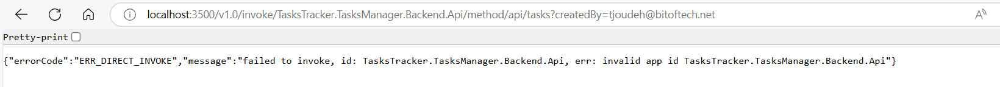

## Troubleshooting

You may encounter some challenges while progressing through this workshop. Please [update or create an issue](https://github.com/Azure/aca-dotnet-workshop/issues?q=is%3Aissue){target=_blank} to help us resolutions below. Thank you!

### Dapr

#### ERR_DIRECT_INVOKE

If you encounter an `ERR_DIRECT_INVOKE` error with Dapr, check that ...

- You have [installed and initialized Dapr](../00-workshop-intro/4-prerequisites.md){target=_blank}, and
- You do not have a restrictive VPN or firewall running.
